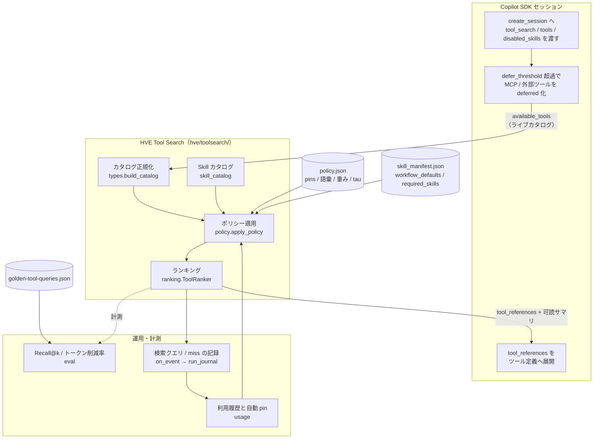
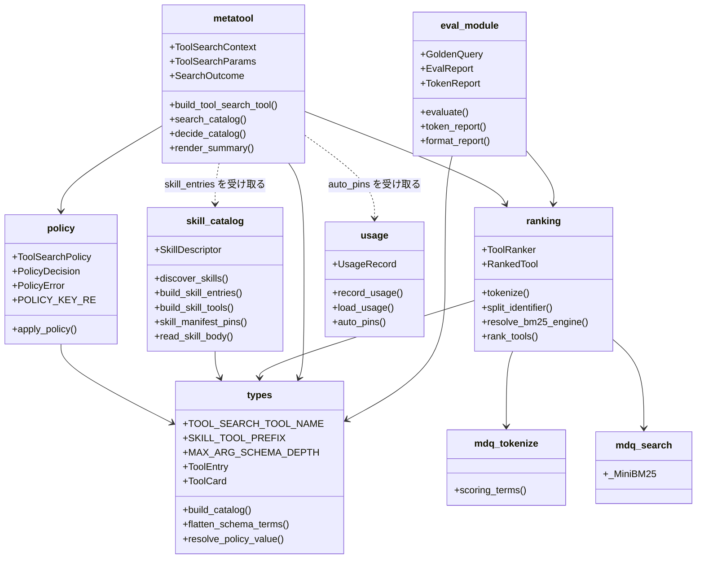
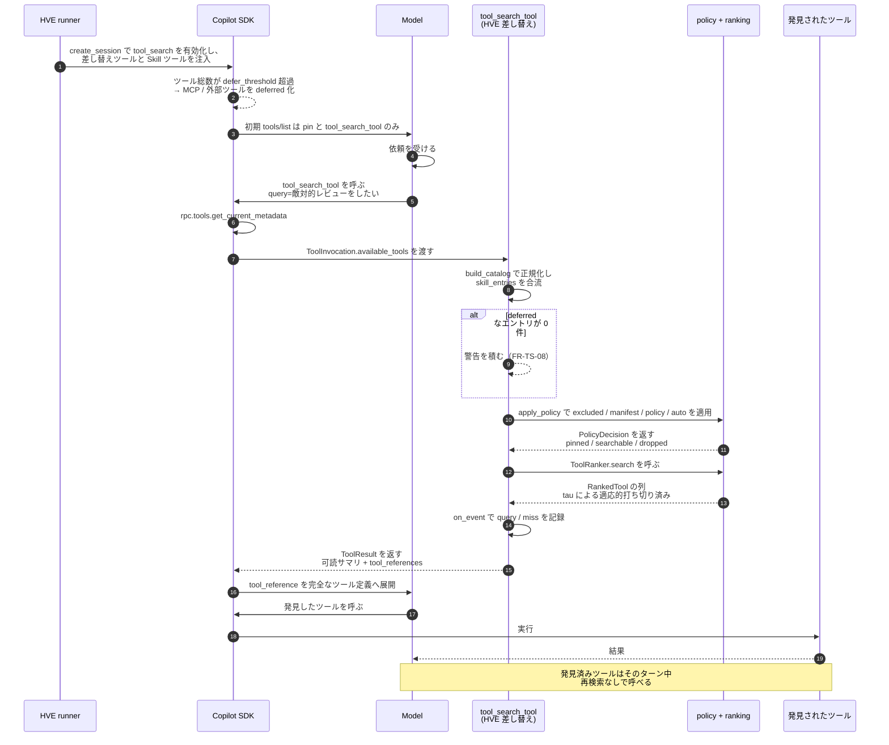
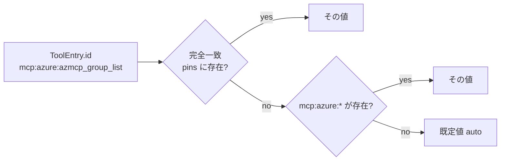
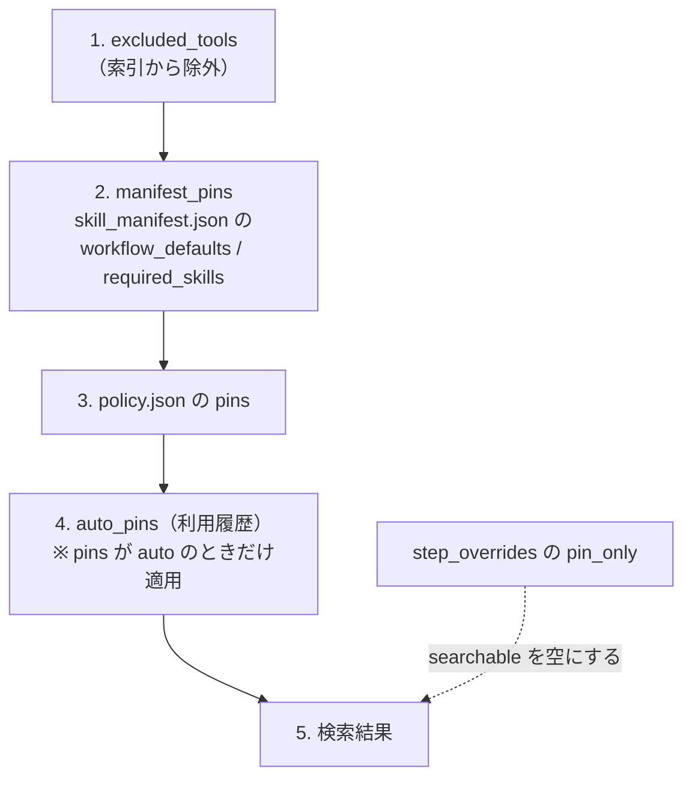
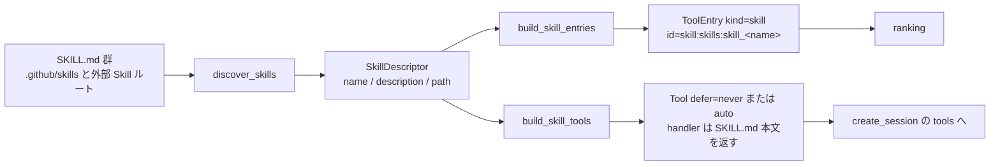

# Tool Search（HVE ランタイムのツール検索）

← [README](../README.md)

HVE 自身の Copilot SDK セッションに対して、**ツール定義を毎ターン全件渡すのをやめ、
必要なものだけをその場で発見させる**ための仕組み。ランキングを HVE が所有し、
`policy.json` でカスタマイズできる。

> **本ガイドの対象を取り違えないこと**
>
> | ドキュメント | 対象 | 実体 |
> |---|---|---|
> | **本ガイド** | **HVE 自身**が動くときのツール表面 | `hve/toolsearch/`（HVE 実装） |
> | [tool-search-guide.md](tool-search-guide.md) | HVE が**生成する AI Agent** のツール表面 | Microsoft Foundry Toolbox の設定 |
>
> 両者は別物。本ガイドの Tool Search は Foundry を使わない。
>
> また、HVE の native ツール `search_markdown` / `search_code`（[hve/repository_query_tools.py](../hve/repository_query_tools.py)）は
> **リポジトリ本文を検索する**ツールであり、「ツールを探すツール」である本ガイドの Tool Search とは別物。

> **実装状況（2026-08-13 時点）**
>
> `hve/toolsearch/` のモジュールと単体テスト、CLI / GUI / runner への配線まで完了している。
> Tool Search 関連の単体テストは本リポジトリで **346 件**を収集する（2026-08-13 実測。件数はテスト追加で増えるため、常に下記コマンドで再確認すること）。
>
> ```sh
> python -m pytest hve/tests -k toolsearch --collect-only -q
> ```
>
> （`hve/tests/test_toolsearch_*.py` のような glob は **PowerShell では展開されず失敗する**。`-k` を使うこと。
> `-k toolsearch` は専用モジュール `test_toolsearch_*.py`（320 件）に加えて、他モジュール内の
> Tool Search 関連テストも拾うため件数が多くなる）
>
> 遅延ロード（`--tool-search`）は**既定で有効**だが、**ランキングの HVE 実装への差し替えは既定で無効**で、
> `--tool-search-ranking hve` を指定したときにだけ動く（§8）。
> Cloud Session 経路は G4（カスタム `tools` の可否）が未実測のため、当面差し替えを行わない。

> ## ⚠ 現行 CLI ではこの機能を有効化しないこと（2026-08-13 実測、Copilot CLI 1.0.79 / SDK 1.0.7）
>
> `session.metadata.contextInfo` で計測した結果、**この CLI では遅延公開（deferral）が一切発火しない**。
>
> | 条件 | toolDefinitionsTokens |
> |---|---|
> | `tool_search` 無効 | 52,756 |
> | `tool_search` 有効 | 52,756 |
> | `tool_search` 有効 + `defer_threshold=1` | 52,756 |
>
> 3 条件が完全一致し、全 183 ツールの `defer_loading` は `null`、`tool_search_tool` もツール一覧に現れない。
> `toolDefinitionsTokens` は SDK 定義上 "excludes deferred tools" であるため、この一致は
> 「遅延化されたツールが 0 件」であることを意味する。
>
> さらに `--tool-search-ranking hve` を有効にすると、`hve/toolsearch/` が Skill 73 件をツールとして
> 登録するのに deferral が働かないため、ツール定義が **47,115 → 59,275 tokens（+12,160）** に増えた。
>
> ### このページの読み方（実測を反映した運用方針）
>
> | 目的 | すべきこと |
> |---|---|
> | **本番ワークフローを回す** | `tool_search_ranking` を **`sdk`（既定）のまま**にする。何も設定しない。本ページの §8 以降は読まなくてよい |
> | **コンテキストを削る** | 本機能ではなく、公開する MCP サーバ自体を絞る（FR-CLI-76: Step 実行セッションは `.github/.mcp.json` の宣言分のみを公開する） |
> | **実装を保守 / 将来の SDK で再評価する** | §8 の手順で `--tool-search-ranking hve` を有効化し、[tool-search-dashboard.md](tool-search-dashboard.md) で `deferral_inactive_rate` を見る。**1.0 のままなら本実測と同じ状態**で、削減効果は得られない |
>
> なお **明示指定する MCP サーバ設定には `tools` キーが必須**で、欠けているとそのサーバは起動されず
> ツールが 1 件も公開されない（実測で確認）。

## 0. この文書の読み方

| 項目 | 内容 |
|---|---|
| 対象読者 | HVE 自身の実行時ツール表面を運用・調整する Software Engineer と、`hve/toolsearch/` を拡張する開発者 |
| スコープ | HVE runtime（Copilot SDK セッション）の Tool Search。有効化・ポリシー・ランキング・評価・拡張 |
| 非対象 | HVE が**生成する** AI Agent の Foundry Toolbox 設定（[tool-search-guide.md](tool-search-guide.md)）、実行時統計の指標定義（[tool-search-dashboard.md](tool-search-dashboard.md)） |
| 前提 | Python 3.11 以上、リポジトリルートで `python -m hve` が起動できること。`pydantic` が導入済みであること |
| 次のステップ | §1〜§7 で仕組みを理解 →（**検証目的の場合のみ**）§8 で有効化 → [tool-search-dashboard.md](tool-search-dashboard.md) で観測 → §9 で評価・調整 |

### 最短の利用手順（検証目的）

> **この手順は本番運用向けではない。** 上の実測のとおり、現行 CLI では差し替えを有効化すると
> ツール定義トークンが**増える**。実装の動作確認や、SDK 更新後の再評価のときだけ使うこと。

| 段階 | 内容 |
|---|---|
| 前提 | 上表の前提を満たし、Cloud Session を使わない経路で実行すること（Cloud では差し替えが行われない。§8「未実測の事項」G4） |
| 操作 | `python -m hve orchestrate --workflow <id> --tool-search-ranking hve` |
| 入力 | `hve/toolsearch/policy.json`（ポリシー）、`.github/skills/**/SKILL.md`（Skill カタログ）、`hve/skill_manifest.json`（存在する場合の manifest pin） |
| 出力 | モデルへ返る検索結果（可読サマリ + `tool_references`）、`＜repo-root＞/.toolsearch/events.jsonl`、`＜repo-root＞/.toolsearch/usage.jsonl` |
| 完了確認 | `python -m hve toolsearch dashboard` で「検索回数」が 1 以上になること |
| 失敗時対応 | 検索回数が 0 のままなら [tool-search-dashboard.md §4](tool-search-dashboard.md#4-検索回数が-0-のままの切り分け) の切り分けフローへ。`policy.json` が不正な場合は差し替えを行わず SDK 既定へフォールバックする（Step は落ちない。§8） |
| 終了後 | 検証が終わったら `--tool-search-ranking` を外して既定の `sdk` へ戻す |

---

## 1. 解こうとしている問題

エージェントにツールを足すと能力は増えるが、**ツール定義は毎ターンのコンテキスト費用**になる。
名前・説明・JSON Schema・引数定義・ネストしたパラメータが、まだ何も依頼していない段階で
プロンプトに載る。prompt cache が効いていてもキャッシュ済みトークンは無料ではなく、
モデルの attention も消費する。

HVE では実測でこうなっている。

| 事実 | 値 | 取得時点 | 出典 |
|---|---|---|---|
| 登録ツール数とその定義トークン量 | **171 ツール / 54,865 tokens** | FR-MODEL-04 記録時 | `hve-dev/requirement-definition.md` FR-MODEL-04 |
| うち実際に使われた分 | **10 種 / 9,108 tokens** | 同上 | 同上 |
| 登録ツール数とその定義トークン量（再測） | **183 ツール / 52,756 tokens** | 2026-08-13 | 冲頭バナー（Copilot CLI 1.0.79 / SDK 1.0.7） |
| リポジトリ内 Skill | **35 件** | 2026-08-13 | `.github/skills/**/SKILL.md` の実測（`*/SKILL.md` だけだと 20 件。`**` でサブディレクトリも数える） |

> ツール総数は接続する MCP サーバの顔ぶれで変わるため、**日付の違う値が並ぶのは正常**である。
> 自環境の値は `python -m hve toolsearch context` で取る（§9）。

つまり **9 割近くが「読まれるだけで使われない」**。Tool Search はこの差を埋める。

外部の報告も同じ構造を示している（数値は各出典のベンチマーク条件に依存する）。

| 報告 | 内容 |
|---|---|
| Microsoft Foundry | ToolRet ベンチ（44,000+ tools / 7,000 queries）で、50 ツール時に **60% 超**、1,000 ツール時に **97% 超** のトークン削減 |
| Microsoft Foundry | ツールの説明とエイリアスを調整することで **検索ヒット率 +約56% / エンドツーエンド精度 +約55%**、全ツール前置きの baseline との差を **約 4% 以内**まで縮小 |
| Anthropic | GitHub / Slack / Sentry / Grafana / Splunk を束ねた構成でツール定義だけで **約 55k tokens**。tool search で **85% 超**削減。ツールが **30〜50 個**を超えると選択精度が劣化 |

→ これは単なるトークン最適化ではなく、**情報検索（Information Retrieval）の問題**である。
ツール名と説明はドキュメントではなく **ランキングの素性**になる。

---

## 2. 設計方針 — SDK に任せる部分と HVE が持つ部分

GitHub Copilot SDK（実測 1.0.7）は、遅延ロードの土台を**すでに持っている**。

| SDK が提供するもの | 実体 |
|---|---|
| 遅延化の発火 | `create_session(tool_search={"enabled": bool, "defer_threshold": int})` |
| 差し替え口 | `tool_search_tool` という名前の `Tool` を `overrides_built_in_tool=True` で登録すると実装を置き換えられる |
| ライブカタログの受け渡し | `ToolInvocation.available_tools`（`CurrentToolMetadata` の列）。**この呼び出しのときだけ** SDK が渡す |
| 発見結果の展開 | `ToolResult.tool_references`（ツール名の列）を返すと SDK が定義へ展開する |
| MCP のツール単位公開制御 | `MCPHTTPServerConfig.tools` / `MCPStdioServerConfig.tools`（`"*"` = 全件 / `[]` = なし）、`MCPServerConfigDeferTools`（`auto` / `never`） |
| Skill の無効化 | `create_session(disabled_skills=[...])` |

したがって HVE が自前で作る必要は**ない**もの:

- `call_tool` 相当のディスパッチプロキシ（`tool_references` を返せば SDK が展開・実行まで担う）
- MCP へ `tools/list` を発行するカタログ収集（`available_tools` が渡ってくる。SDK の docstring に
  "without issuing its own RPC" と明記されている）
- SQLite などの永続索引（カタログは毎回渡るのでセッション内で完結する）

**HVE が所有する価値はランキングと運用**である。

1. 日本語で機能する検索（HVE のプロンプトと Skill 説明は日本語）
2. Skill をカタログへ合流させること（SDK の `available_tools` に Skill は現れない）
3. pin ポリシー（Core を常時公開、long-tail を検索へ）
4. 評価（Recall@k とトークン削減率）

### 2.1 CLI 組み込み実装との対比

`tool_search_tool` の既定実装は **Copilot CLI ランタイム側**にあり、SDK は設定を wire へ転送するだけである
（`copilot/client.py` の `_tool_search_to_wire` が送るのは `enabled` と `deferThreshold` の 2 キーのみ）。
したがって CLI 組み込みと HVE 実装は競合する 2 つの機能ではなく、**同じ 1 つの拡張ポイントを誰が実装するか**の違いになる。

| 観点 | CLI 組み込み | HVE 差し替え（`--tool-search-ranking hve`） |
|---|---|---|
| 実装の所在 | CLI ランタイム内 | `hve/toolsearch/`（リポジトリ内 Python） |
| クライアントから調整できるもの | `enabled` / `defer_threshold` の **2 つだけ** | `policy.json` の全項目 + `ranking.py` |
| ランキングアルゴリズム | **本リポジトリからは確認できない** | フィールド重み付き BM25（§7.1） |
| 日本語クエリでの挙動 | **未確認** | CJK 隣接バイグラム + 識別子分解（§7.2） |
| 検索対象 | `available_tools` = MCP + 外部ツール。**Skill は含まれない** | 上記 + Skill（§7.5） |
| 引数スキーマの索引 | 未確認 | ネスト 3 階層まで平坦化（`MAX_ARG_SCHEMA_DEPTH`） |
| 検索専用語彙 | 無し | `additional_search_text`（索引のみ / モデルへ返らない。§6.4） |
| pin | 無し | `policy.json` / `skill_manifest.json` / 利用履歴の自動 pin（§6.3 / §7.6） |
| 返却件数の制御 | 未確認 | `limit` 5（最大 10）+ `tau` による適応的打ち切り（§7.4） |
| モデルへの案内文 | system message の `tool_instructions`（`customize` モード）で調整 | 差し替え実装の `TOOL_SEARCH_DESCRIPTION` |
| 実行時ログ | 無し | `.toolsearch/events.jsonl` / `usage.jsonl`（[tool-search-dashboard.md](tool-search-dashboard.md)） |
| 検索品質の評価 | 無し | golden クエリで Recall@k / MRR（§9） |
| 遅延化の発火判定 | **CLI 側**が持つ | 同左。差し替えても変わらない（§7.7） |
| 呼び出し禁止の強制 | `excluded_tools` / MCP の `tools` allowlist | 同左。ランカーは安全境界ではない（§6.3） |

> **「未確認」は「無い」という意味ではない。** CLI 組み込み実装は SDK 側から読み取れないため、
> 本リポジトリで検証できた範囲だけを記載している。冒頭バナーの実測のとおり、現行 CLI では
> そもそも `tool_search_tool` がツール一覧に現れないため、組み込み実装の挙動自体を観測できていない。

---

## 3. アーキテクチャ図



**遅延化そのものは SDK 側**、**「何を返すか」は HVE 側**、という責務分割になっている。

---

## 4. コンポーネント図



> 図中の `eval_module` は `hve/toolsearch/eval.py`、`mdq_tokenize` / `mdq_search` は
> `mdq.tokenize` / `mdq.search`。Mermaid の識別子制約のため別名にしている。
> `session.py` / `stats.py` / `dashboard.py` / `context_report.py` は検索本体のクラス協調に関与しないためこの図には現れない。全 11 モジュールの一覧は下表を見ること。

各モジュールの責務（`hve/toolsearch/` 配下の全モジュール。`__init__.py` を除く）。

| モジュール | 責務 | 対応要件 |
|---|---|---|
| `types.py` | `ToolEntry` / `ToolCard`、カタログ正規化、引数スキーマのネスト 3 階層平坦化 | FR-TS-02 |
| `policy.py` | `policy.json` の検証、pin 優先順位の解決 | FR-TS-03 |
| `skill_catalog.py` | `SKILL.md` の収集とツール登録、`skill_manifest.json` 由来 pin | FR-TS-06 |
| `ranking.py` | 日本語対応のフィールド重み付き BM25、適応的打ち切り | FR-TS-04 |
| `metatool.py` | `tool_search_tool` の差し替え、遅延不活性の検知 | FR-TS-01 / 08 |
| `usage.py` | 利用履歴と自動 pin | FR-TS-07 |
| `eval.py` | Recall@k / MRR / トークン削減率 | FR-TS-05 |
| `session.py` | `SDKConfig` からの組立と有効化判定、runner への注入口 | FR-TS-01 |
| `stats.py` | 実行時イベントの収集と集約 | FR-TS-09 |
| `dashboard.py` | テキスト / JSON / HTML 描画とライブ更新 | FR-TS-10 |
| `context_report.py` | `hve toolsearch context` の実体。実運用セッションのコンテキスト内訳を実測する（§9） | — |

---

## 5. メッセージフロー図



`text_result_for_llm` には `ToolCard` から生成した人間可読サマリだけが載る。
**検索専用語彙（`additional_search_text`）は `ToolCard` のフィールドとして存在しない**ため、
構造上モデルへ返らない。

---

## 6. カスタマイズ — `hve/toolsearch/policy.json`

> **どのファイルが読まれるか。** リポジトリルート直下に `.toolsearch/policy.json` があればそれを、
> 無ければ同梱の [hve/toolsearch/policy.json](../hve/toolsearch/policy.json) を使う。
> この解決は [hve/toolsearch/policy.py](../hve/toolsearch/policy.py) `ToolSearchPolicy.default_path()` が
> 単一実装として所有し、**実行時・GUI の表示・GUI からの保存のすべてが同じ規則に従う**。

> **以下は構造を示すための抜粋である。** `pins` / `additional_search_text` / `step_overrides` の
> エントリは実ファイルの方が多い。現在値は [hve/toolsearch/policy.json](../hve/toolsearch/policy.json) を
> 直接見るか、GUI の「ポリシー」タブで確認すること（同タブから編集もできる。§6.5）。

```jsonc
{
  "version": 1,
  "limit": 5,            // 1 回の検索で返す既定件数
  "max_limit": 10,       // モデルが limit を指定しても超えない上限
  "tau": 0.4,            // 適応的打ち切り: score >= tau * top_score のみ返す

  "field_weights": {     // フィールド重み付き BM25 の重み
    "name": 3.0,
    "additional_search_text": 2.5,
    "description": 2.0,
    "arg_terms": 1.0
  },

  "pins": {              // 抜粋。実ファイルは Core Skill 3 件 + MCP 2 サーバを含む
    "native:hve:*": "always",
    "skill:skills:skill_work-artifacts-layout": "always",
    "mcp:azure:*": "auto"
  },

  "additional_search_text": {   // 抜粋。実ファイルは native 4 件 + skill 5 件 + MCP 1 件
    "native:hve:search_markdown": "仕様 要件 ドキュメント 設計書 横断検索 根拠"
  },

  "step_overrides": {           // 抜粋。実ファイルは asdw-web:1.2 と 1.3
    "asdw-web:1.2": { "mode": "pin_only" }
  }
}
```

不正な値は **`ToolSearchPolicy.load()` の時点で `PolicyError`** になる（起動後に静かに壊れない）。

### 6.1 キー形式（最重要）

キーは **`{kind}:{server}:{name}`** か **`{kind}:{server}:*`** のみ。
`kind` は `mcp` / `native` / `skill`。

**ツール名だけのキー（例: `"execute_query"`）はロード時に拒否される。**
MCP サーバー間でツール名は衝突しうるため、暗黙のフォールバックを許すと
別サーバーの同名ツールへ pin が誤って効く。解決順は「完全一致 → サーバーワイルドカード → 既定値」。



### 6.2 `pin` の 3 値

| 値 | 意味 | tools/list | 検索対象 | 自動 pin |
|---|---|---|---|---|
| `always` | **Core**。検索を経ずに呼べる | 出る | — | — |
| `auto` | **Long-tail** | 出ない | 対象 | **対象** |
| `never` | Long-tail のまま固定 | 出ない | 対象 | 対象外 |

`never` は **「索引から消す」ではない**。消す唯一の手段は `excluded_tools`。

### 6.3 pin の優先順位



> **ランカーは安全境界ではない。** 制御できるのは「何を返すか」だけで、呼び出しを禁止する力は無い。
> 禁止の強制は `excluded_tools` と MCP サーバー設定の `tools` allowlist（`[]` = なし）が担う。
> この境界は `hve/toolsearch/policy.py` の docstring とテスト `TestEnforcementBoundary` で固定している。

### 6.4 `additional_search_text` — 検索語彙の外挿

実装として正しい説明が、利用者の語彙と一致するとは限らない。

> `execute_query` の説明が「設定済みのデータベースに対してクエリを実行します」だけだと、
> 「ダッシュボード用のデータが欲しい」「SQL レポートを作りたい」では見つからない。

`additional_search_text` に「分析 ダッシュボード SQL レポート ウェアハウス テーブル構造」を足すと
索引にだけ載り、**モデルへ渡るツール定義は 1 トークンも増えない**。

本リポジトリでの実測: この外挿だけで golden の miss が **1 → 0**、MRR が **0.846 → 0.907** に改善した。
トークン削減率は 78.6% のまま変わらない（設計どおり）。取得条件は §9「取得条件」と同じ。

### 6.5 GUI から編集する

JSON を直接編集する代わりに、**設定画面 → skills → Tool-Search → 「ポリシー」タブ**から
同じファイルを編集できる。各項目名の右にある `?` を押すと、値の意味・増減したときの影響・
既定値の説明が出る（説明文の実体は [hve/gui/help_content.py](../hve/gui/help_content.py)）。

| 項目 | 画面での編集方法 |
|---|---|
| `version` | 書式のバージョンなので**表示のみ**。編集できない |
| `limit` / `max_limit` / `tau` | 数値入力 |
| `field_weights` | 4 フィールドそれぞれの数値入力 |
| `pins` / `additional_search_text` / `step_overrides` | 表形式。「行を追加」「選択行を削除」で増減する |

編集時の約束は次のとおり。

| 事項 | 挙動 |
|---|---|
| 保存先 | 画面上部に出ている「参照元 / 保存先」のパスと同一。`.toolsearch/policy.json` がある場合はそちら、無ければ同梱の `hve/toolsearch/policy.json`（§6 冒頭のパス解決と同じ）。実行時もこの解決規則で読むため、表示・保存・実行時の 3 者が一致する |
| 保存のタイミング | 設定画面の他の項目と違い**自動保存されない**。「保存」ボタンを押したときだけ書き込む |
| 検証 | 書き込み前に `ToolSearchPolicy.from_dict()` と同じ検証を通す。キー形式違反・`limit > max_limit` などがあると**ファイルを 1 バイトも変更せず**、理由を画面下部に表示する |
| `_comment` | JSON 内の未知のトップレベルキーは保存後も残る |
| 反映 | **次に開始する Step 実行から**反映される。実行中のセッションのツール表面は変わらない |
| 読み込み失敗時 | 推測した既定値を表示せず、失敗理由と対象パスだけを出す。この状態からは保存できない（既存の内容を空値で上書きしないため） |

> **保存すると JSON 内の空行は失われる。** JSON に空行を表現する構文が無いためで、値は変わらない。
> 空行を含む整形を保ちたい場合はファイルを直接編集すること。

---

## 7. 内部の仕組み

### 7.1 索引対象

`ToolEntry` の 4 フィールドを別々のコーパスとして索引し、重み付き和を取る。

$$\text{score}(q, t) = \sum_{f \in F} w_f \cdot \mathrm{BM25}(q, t_f),\quad
F = \{\text{name},\ \text{additional\_search\_text},\ \text{description},\ \text{arg\_terms}\}$$

`arg_terms` は入力スキーマの**引数名と引数説明をネスト 3 階層まで**平坦化したもの
（`MAX_ARG_SCHEMA_DEPTH = 3`）。

### 7.2 日本語トークナイズ

`mdq.tokenize.scoring_terms()` を再利用する。CJK の連続は**隣接バイグラム**に分割される
（`mdq/tokenize.py` の docstring では Lucene の `CJKBigramFilter` を模したものと説明されている）。
加えて識別子を部分語へ展開する。

| 入力 | 生成されるトークン（抜粋） |
|---|---|
| `敵対的レビュー` | `敵対` `対的` `的レ` `レビ` `ビュ` `ュー` |
| `search_markdown` | `search_markdown` `search` `markdown` |
| `mcp__azure__group_list` | `mcp` `azure` `group` `list` |
| `azmcpGroupList` | `azmcp` `group` `list` |

### 7.3 BM25 実装の選択（重要な実測）

**既定は `mdq.search._MiniBM25`**。`rank_bm25.BM25Okapi` は既定にしない。

理由: `BM25Okapi` の idf は $\log(N - n + 0.5) - \log(n + 0.5)$ であり、
**ある語が全文書のちょうど半数に現れると idf が 0 になる**。小規模カタログではこの退化が実際に起き、
検索結果が全件 0 スコアになる（本リポジトリで実測。回帰テスト
`test_rank_bm25_degenerates_to_zero_idf_on_small_catalogs` で固定）。

`_MiniBM25` の idf は $\log\!\left(1 + \frac{N - n + 0.5}{n + 0.5}\right)$ で常に正。
速度差はカタログ数百件の規模では問題にならない。明示的に切り替えたい場合は
`ToolRanker(..., engine="rank_bm25")` / `rank_tools(..., engine="rank_bm25")`。

> 高速な BM25 実装としては `bm25s`（arXiv:2407.03618）がある。永続索引を持たない設計になり
> 対象が数百件へ縮小したため、本実装では採用していない。

### 7.4 適応的打ち切り

上位 `limit` 件に加え、`score >= tau * top_score` を満たすものだけを返す。
全件が閾値未満なら **空を返す**（誤ったツールを掴ませない）。同点は `ToolEntry.id` 昇順で
決定論的に解決する。

固定件数を常に返すのが最適ではないという指摘は PTR（arXiv:2411.09613）が示している。

### 7.5 Skill のカタログ合流

Skill は SDK の `available_tools` に現れない。そこで各 Skill を `define_tool` でツールとして
登録し、同一カタログでランキングする。



- Core Skill は `defer="never"`（常時公開）、それ以外は `defer="auto"`（遅延公開）
- handler は SKILL.md 本文を返す。`MAX_SKILL_BODY_CHARS = 20,000` を超えると切り詰め、
  続きを読むためのパスを添える
- **`disabled_skills` は「恒久的に使わせない Skill」だけに使う。** long-tail Skill の唯一の
  手段にすると、必要な場面で発見できなくなる（資格情報のローテーション、障害復旧、
  監査証跡の確認など、稀にしか使わないが決定的なものが該当する）

### 7.6 自動 pin

`＜repo-root＞/.toolsearch/usage.jsonl`（`HVE_TOOLSEARCH_USAGE` で差し替え可）に利用履歴を追記し、
頻用ツールを pin へ昇格させる。

| パラメータ | 既定 | 意味 |
|---|---|---|
| `DEFAULT_WARMUP_SESSIONS` | 20 | これ未満のセッション数では静的 pin のみ |
| `DEFAULT_TOP_N` | 3 | 昇格させる上位件数 |
| `DEFAULT_WINDOW_SESSIONS` | 50 | 集計対象の直近セッション数（古い傾向は失効） |

昇格の単位は **workflow × step**。Foundry Toolbox の auto-pin は利用者単位だが、
HVE のセッションは step ごとに役割が固定されているため、step 単位のほうが
公開ツール集合が安定し **prompt cache の prefix が壊れない**。同一履歴に対して常に
同一順序を返す（同点は tool_id 昇順）。

### 7.7 遅延公開が発火していないことの検知

`defer_threshold` の既定値は **サーバー側（CLI ランタイム）にあり、クライアントから静的に
確認できない**（`copilot/client.py` は wire へ転送するだけ）。閾値に達していないと
差し替えたランカーが一度も呼ばれず、しかも**失敗としては現れない**。

そのため `available_tools` に `defer_loading=True` のエントリが 0 件のときは警告を返す
（`NO_DEFERRED_TOOLS_WARNING`）。カタログのスナップショット自体が取れなかった場合も
`EMPTY_CATALOG_MESSAGE` を返し、例外にはしない。

---

## 8. 有効化のしかた

> **本番運用ではこの節を適用しないこと。** 冲頭バナーの実測（2026-08-13）のとおり、
> 現行 CLI では差し替えを有効化するとツール定義トークンが **増える**。
> 以下は **実装の動作確認と、SDK 更新後の再評価** のための手順である。

**ランキングの差し替えは既定で無効**。遅延ロード自体は既定有効なため、差し替えには `--tool-search-ranking hve` を追加する。

```bash
python -m hve orchestrate --workflow ard \
    --tool-search-ranking hve
```

| 経路 | 指定方法 |
|---|---|
| CLI | `--tool-search-ranking {sdk,hve}`（遅延ロードを切る場合は `--no-tool-search`） |
| 環境変数 | `HVE_TOOL_SEARCH_RANKING=hve`（遅延ロードを切る場合は `HVE_TOOL_SEARCH=0`） |
| GUI | 設定画面 → skills → **Tool-Search** → 基本（ポリシーの編集と統計も同じセクション） |

### 似た名前の設定 3 種の違い

| 設定 | ドメイン | 値 | 既定 |
|---|---|---|---|
| `--tool-search` | **HVE 自身**の SDK セッション。組み込みツール検索の有効化（FR-MODEL-04） | bool | 有効（`--no-tool-search` で無効） |
| `--tool-search-ranking` | **HVE 自身**。上を有効にしたときのランキング実装（FR-TS-01） | `sdk` / `hve` | `sdk` |
| `--enable-tool-search` | **生成する AI Agent** の Foundry Toolbox 設定 | `auto` / `yes` / `no` | `auto` |

`--no-tool-search` で遅延ロードを無効にした場合、SDK は `tool_search_tool` を呼ばないため、
`--tool-search-ranking hve` だけを指定しても何も起きない。

### 配線の実装（拡張したい場合）

`hve/runner.py` は `hve/toolsearch/session.py` のヘルパー 1 本を呼ぶだけ。

```python
from hve.toolsearch.session import build_session_toolset

tools, context = build_session_toolset(
    config,                      # SDKConfig
    repo_root=Path.cwd(),
    workflow_id=workflow_id,
    step_id=step_id,
    enabled=not should_use_cloud_session(config, step_id=step_id),
)
if tools:
    session_opts["tools"] = list(session_opts.get("tools") or []) + tools
```

戻り値 `tools` の先頭が `tool_search_tool`（`overrides_built_in_tool=True`）で、
以降が Skill ツール。組立に失敗しても `([], None)` を返すので Step は落ちない。

Step 終了時には `StepRunner._record_toolsearch_usage()` が呼ばれ、
実際に呼ばれたツール名を `ToolEntry.id` へ解決して履歴へ記録する（自動 pin の学習）。
未知のツール名は **推測せず落とす**（MCP サーバー間で名前が衝突しうるため）。

### 未実測の事項

| # | 事項 | 現状の扱い |
|---|---|---|
| G1 | サーバー側 `defer_threshold` の既定値 | 発火していないことは FR-TS-08 の警告で検知できる |
| G2 | Skill の tool 登録が `skill_directories` 経由の公開と二重計上しないか | 未検証 |
| G3 | `defer="auto"` の custom tool が実際に deferred 化されるか、ツール数上限に当たらないか | 未検証 |
| G4 | Cloud Session でカスタム `tools` が有効か | **未検証のため Cloud 経路では差し替えを行わない** |

### カスタマイズの正本・拡張手順・回帰検証・互換性

| 変えたいもの | 設定の正本（ここだけを編集する） | 拡張手順 | 回帰検証 |
|---|---|---|---|
| pin / 検索語彙 / `limit` / `tau` / フィールド重み / Step 別モード | `hve/toolsearch/policy.json` | §6 のキー形式に従って編集。GUI の「ポリシー」タブからも編集できる（§6.5） | `python -m pytest hve/tests/test_toolsearch_policy.py hve/tests/test_toolsearch_eval.py -q` |
| ランキングアルゴリズム | `hve/toolsearch/ranking.py`（`ToolRanker` / `rank_tools`） | `engine` を追加する場合は `resolve_bm25_engine()` を拡張する | `python -m pytest hve/tests/test_toolsearch_ranking.py -q` と Recall@10 の再計測 |
| カタログ正規化・引数語彙の平坦化 | `hve/toolsearch/types.py`（`build_catalog` / `flatten_schema_terms`） | `MAX_ARG_SCHEMA_DEPTH` を変える場合は索引サイズへの影響を評価する | `python -m pytest hve/tests/test_toolsearch_contract.py hve/tests/test_toolsearch_policy.py -q` |
| Skill の収集範囲 | `hve/toolsearch/session.py` の `default_skill_roots()` | 追加ルートを返すよう変更するか、`build_session_toolset(skill_roots=...)` へ渡す | `python -m pytest hve/tests/test_toolsearch_skillcatalog.py hve/tests/test_toolsearch_wiring.py -q` |
| Step 固定の必須 Skill | `hve/skill_manifest.json`（`workflow_defaults` / `required_skills`） | `optional_skills` は long-tail 扱いで pin にならない | `python -m pytest hve/tests/test_toolsearch_wiring.py -q` |
| 自動 pin の学習パラメータ | `hve/toolsearch/usage.py`（`DEFAULT_WARMUP_SESSIONS` / `DEFAULT_TOP_N` / `DEFAULT_WINDOW_SESSIONS`） | 定数を変更する。履歴の保存先は `HVE_TOOLSEARCH_USAGE` で差し替える | `python -m pytest hve/tests/test_toolsearch_autopin.py -q` |
| 評価クエリ | `hve/toolsearch/golden-tool-queries.json` | §9 の形式で追加する | `python -m pytest hve/tests/test_toolsearch_eval.py -q` |

まとめて確認する場合は `python -m pytest hve/tests -k toolsearch -q`。
**`hve/tests/test_toolsearch_*.py` のような glob は PowerShell では展開されず失敗する**ので、`-k` を使うこと。
`PySide6` / `copilot` SDK が未導入の環境では GUI と SDK 配線のテストが `ModuleNotFoundError` で失敗するため、
その 2 つは導入済み環境で確認すること。

**互換性・安全性で壊してはならない境界**

- ランカーは安全境界ではない。呼び出し禁止は `excluded_tools` と MCP サーバー設定の `tools` allowlist が担う（§6.3）。
- `policy.json` のキーは `{kind}:{server}:{name}` 形式のみ。ツール名だけのキーを許す変更を入れない（§6.1）。
- `additional_search_text` は `ToolCard` に持たない。モデルへ返す経路へ足さない（§5）。
- `ToolSearchPolicy.load()` の失敗時は差し替えを行わず SDK 既定へフォールバックする。Step を落とす変更を入れない。
- 同点は `ToolEntry.id` 昇順で解決する決定論を維持する（§7.4）。順序が揺れると prompt cache の prefix が壊れる。

---

## 9. 評価とチューニング

```bash
python -m pytest hve/tests/test_toolsearch_eval.py -q
```

`hve/toolsearch/golden-tool-queries.json` に日本語クエリと正解ツール ID を書く。

```jsonc
{ "query": "敵対的レビューをしたい", "expected": ["skill_adversarial-review"] }
```

### 計測結果

#### 取得条件（再現に必要な前提）

| 項目 | 値 |
|---|---|
| 取得日 | 2026-08-04（Recall / MRR / miss / カタログ件数は 2026-08-07 に再取得して同値を確認） |
| 対象カタログ | `.github/skills` の Skill 35 件 + native 4 ツール = **39 件**（MCP ツールは接続しないと列挙できないため含まない） |
| golden | `hve/toolsearch/golden-tool-queries.json` の **42 クエリ** |
| ポリシー | `hve/toolsearch/policy.json`（`field_weights` をそのまま使用、`limit=10`） |
| トークン推定 | `tiktoken`（`cl100k_base`）が導入されている環境の値。未導入環境では `文字数 // 4` の概算にフォールバックするため、絶対値は一致しない |

| 指標 | 値 | 受入基準 |
|---|---|---|
| Recall@5 | 0.940 | — |
| **Recall@10** | **0.964** | ≥ 0.85 |
| MRR | 0.907 | — |
| miss | 0 件 | — |
| **トークン削減** | **78.6%**（5,072 → 1,084） | ≥ 60% |

> **削減率は下限値。** 計測対象に MCP ツールを含んでいない（接続しないと列挙できないため）。
> 実運用の規模は FR-MODEL-04 の実測（171 ツール / 54,865 tokens）を参照。
>
> **絶対値は環境依存。** `tiktoken` が無い環境で同じ手順を実行すると、
> 2026-08-07 の再取得では 3,204 → 704（削減 78.0%）となった。削減**率**はほぼ変わらないが、
> トークン数そのものを他環境の値と直接比較しないこと。
> 受入基準（Recall@10 ≥ 0.85）は `hve/tests/test_toolsearch_eval.py` が固定している。

### 実運用のコンテキスト内訳を実測する（`hve toolsearch context`）

上の評価値はローカルのカタログとトークン推定に基づく**目安**であり、実運用のセッションで
実際に何にトークンが使われているかは示さない。実測にはこちらを使う。

```bash
python -m hve toolsearch context          # テキスト
python -m hve toolsearch context --json   # 機械可読
```

| 項目 | 内容 |
|---|---|
| 取得元 | Copilot SDK の `contextInfo` / `getContextAttribution` / `getCurrentMetadata` |
| 出力 | モデル名・上限・システムプロンプト・ツール定義（うち MCP）・レイヤー別のツール数とトークン |
| レイヤー | MCP サーバー名ごと + `組み込みツール定義 (builtin)` |
| プロンプト送信 | **しない**（`send` を呼ばないためモデル推論も quota 消費も発生しない） |
| 推定値 | **使わない**。`hve/toolsearch/eval.py` の推定トークンは参照しない |
| MCP 接続待ち | 宣言済みサーバーの接続を最大 60 秒待ち、時間内に接続しなかったものは「未接続」として列挙する（0 トークンとして混ぜない） |
| 失敗時 | 理由を表示して非 0 終了する。数値を推定で埋めない |

Step 実行と同じセッション生成経路（`_create_session_with_auto_reasoning_fallback`）を使うため、
表示される内訳は Step が実際に消費するコンテキストと同じ構成になる。

GUI からは 「設定 > Tool-Search > コンテキスト内訳」 タブの実測ボタンで同じ内容を表示できる
（GUI は CLI の出力をそのまま描画し、再集計しない）。

### チューニングの順序

外部の報告と本リポジトリの実測がともに示すとおり、**最初に効くのはアルゴリズムではなく編集作業**。

1. `format_report()` の miss 一覧を見て、取りこぼしたクエリの語彙を確認する
2. 制御できないツール（MCP）には `policy.json` の `additional_search_text` で語彙を外挿する
3. 制御できる Skill は `SKILL.md` の `description` を直す（USE FOR / DO NOT USE FOR / WHEN 構造は維持）
4. それでも足りなければ `field_weights` と `tau` を動かす
5. 毎回 Recall@10 を再計測して退行していないことを確認する

---

## 10. 既知の制約

| # | 制約 | 扱い |
|---|---|---|
| C1 | `flatten_schema_terms` は `oneOf` / `anyOf` / `allOf` / `$ref` を辿らない | 未対応。Recall 計測で取りこぼしが出たら対応する |
| C2 | `ToolEntry.deferred` は `defer_loading: bool \| None` を `bool` へ潰す | 用途が二値判定のみ |
| C3 | `ToolEntry.id` に MCP の raw name ではなく model-facing name を使う | `tool_references` へ返す値と一致させるため |
| C4 | トークン削減率の計測に MCP を含まない | 下限値として扱う |
| C5 | 検索は BM25（スパース）のみ。ベクトル検索・再ランカーは持たない | Foundry の公開比較では、BM25 ベースの検索が GPU 再ランカー（BGE-reranker-v2-gemma）と Web / Code カテゴリで同等の Recall@10 を示している |
| C6 | Step ごとに Skill ルート配下の `SKILL.md` を全文読み直す | キャッシュしていない。件数はリポジトリと外部 Skill ルートの構成で変わる（本リポジトリ内の `.github/skills/**/SKILL.md` は 2026-08-07 時点で 35 件）。実測でボトルネックになったら対応する |
| C7 | 履歴（`usage.jsonl`）は `--tool-search-ranking hve` のときだけ書かれる | 差し替えを使っていないのに履歴だけ貯めても意味がないため |

---

## 11. 他リポジトリで使う

`hve/toolsearch/` は HVE 本体へ依存していない（外部依存は `pydantic` と、日本語トークナイザの
`mdq.tokenize` だけ）。[tools/for-other-repo/](../tools/for-other-repo/README.md) のコピー script が
必要なファイルを集めて配布パッケージにする（FR-KIT-06）。

```pwsh
# 上流リポジトリで実行（引数はコピー先パス）
python tools/for-other-repo/copy_to_repo.py D:\other-repo\tools\kits -p tool-search

# コピー先リポジトリのルートでセットアップ（Python 3.11+ が無ければ導入してから venv + pydantic）
pwsh -NoLogo -NoProfile -File D:\other-repo\tools\kits\tool-search\install.ps1
```

配布されるもの:

| 内容 | 出所 |
|---|---|
| ランキング・ポリシー・統計・ダッシュボード | `hve/toolsearch/` |
| 日本語対応トークナイザ | `mdq/tokenize.py` |
| 共通セットアップ実装 | `tools/skills/_kit/` |
| CLI 入口（`dashboard` / `skills` / `policy` / `eval`） | `tools/for-other-repo/tool-search/engine/cli.py` |

**他の 2 つ（`markdown-query` / `code-query`）と性格が違う**。Tool Search は Skill ではなく、
Copilot SDK を呼ぶアプリケーション側へ組み込むライブラリなので、`.github/skills/` へは配置しない。
`create_session` への配線例は配布物の `GETTING-STARTED.md` §3 にある。

配布先での制約:

- `session.load_skill_manifest()` は上流固有の `hve/skill_manifest.json` を読む。他リポジトリでは
  存在しないため空として扱われ、`manifest_pins` は効かない（`policy.json` の `pins` は効く）。
- 同梱の `policy.json` は上流の pin / 語彙が入ったまま。導入先の構成に合わせて書き換える
  （再コピーしても上書きされない `preserve` 対象）。
- 同梱の `golden-tool-queries.json` は上流のツール構成向け。`toolsearch eval --golden <自前>` で
  差し替える。

---

## 12. 出典

### 製品ドキュメント・技術記事

| 出典 | URL |
|---|---|
| Tool search: Finding the right tool at the right time（Microsoft, Command Line, 2026-07-29） | https://commandline.microsoft.com/tool-search-toolboxes-foundry/ |
| ツールボックスでツール検索を有効にする（Microsoft Learn） | https://learn.microsoft.com/azure/foundry/agents/how-to/tools/tool-search |
| Tool search tool（Anthropic, Claude Docs） | https://platform.claude.com/docs/en/agents-and-tools/tool-use/tool-search-tool |

### 論文

| 出典 | 要点 |
|---|---|
| Shi et al., *Retrieval Models Aren't Tool-Savvy: Benchmarking Tool Retrieval for Large Language Models*, ACL 2025. arXiv:2503.01763 | 7.6k の検索タスクと 43k ツールからなるベンチ **ToolRet**。従来 IR ベンチで強いモデルもツール検索では低性能で、検索品質の低下がタスク成功率を直接下げる |
| Gan & Sun, *RAG-MCP: Mitigating Prompt Bloat in LLM Tool Selection via Retrieval-Augmented Generation*, 2025. arXiv:2505.03275 | MCP のプロンプト肥大に対し外部索引で意味検索。プロンプトトークン **50% 超削減**、ツール選択精度 **13.62% → 43.13%** |
| Fei, Zheng & Feng, *MCP-Zero: Active Tool Discovery for Autonomous LLM Agents*, 2025. arXiv:2506.01056 | 308 サーバー / 2,797 ツール。能動的ツール要求 + **サーバー → ツールの 2 段階意味ルーティング**。APIBank で **トークン 98% 削減** |
| Gao & Zhang, *Task-Aligned Tool Recommendation for Large Language Models*, IJCNLP-AACL 2025. arXiv:2411.09613 | 上位 N 件固定は非効率で、**最適なツール数はタスクごとに異なる**。履歴から初期集合を作り動的調整 |
| Lù, *BM25S: Orders of magnitude faster lexical search via eager sparse scoring*, 2024. arXiv:2407.03618 | numpy / scipy のみ依存の BM25 実装。索引時に事前スコア計算し **rank_bm25 比 最大 500 倍高速** |

### リポジトリ内

| 出典 | 内容 |
|---|---|
| `hve-dev/requirement-definition.md` §3.5.1 | FR-TS-01〜08 の要件定義 |
| `hve-dev/requirement-test-mapping.md` | FR-TS-01〜08 ↔ テストの対応 |

---

## 関連ガイド

- [tool-search-dashboard.md](tool-search-dashboard.md) — **実行時統計の収集方法と各指標の読み方**
- [tool-search-guide.md](tool-search-guide.md) — HVE が**生成する AI Agent** 側の Foundry Toolbox 設定（別物）
- [skills-markdown-query.md](skills-markdown-query.md) — 本機能が再利用している日本語トークナイザの提供元
- [skills-code-query.md](skills-code-query.md) — ソースコード検索 Skill
- [hve-technical-architecture.md](hve-technical-architecture.md) — HVE 全体の技術アーキテクチャ
