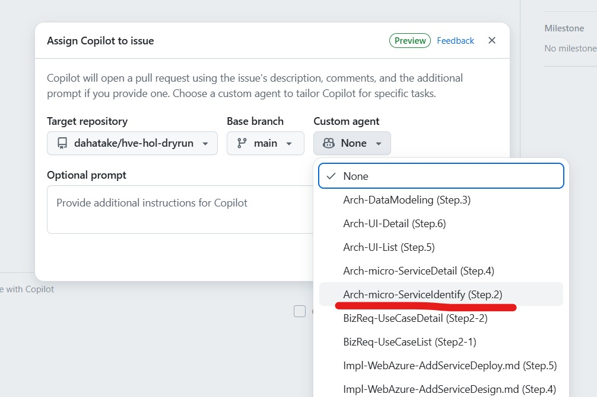

# Web UI 方式ガイド

← [README](../README.md)

---

## 目次

- [概要](#概要)
- [Firewall 設定](#firewall-設定)
- [利用手順](#利用手順)
- [利用可能な Custom Agent 一覧](#利用可能な-custom-agent-一覧)
- [ヒント](#ヒント)

---

## 概要

**Web UI 方式**は、GitHub.com 上で Issue を作成し、GitHub Copilot cloud agent が Issue にアサインされて GitHub Actions 上で自動実行される方式です。

### 基本フロー

```
Issue 作成 → GitHub Actions 起動 → Sub Issue 一括生成
  → Copilot が各 Sub Issue に自動アサイン → PR 作成 → マージ → 次 Step 自動起動
```

### メリット

- Web ブラウザのみで操作可能（ローカル環境のセットアップ不要）
- GitHub Actions の自動化による一貫した実行

### デメリット

- GitHub Actions の課金が発生する
- `COPILOT_PAT` シークレットの設定が必要

> **GitHub Copilot CLI SDK 版（ローカル実行）** との比較は [README](../README.md#2-つの実行方法) を参照してください。

---

## Firewall 設定

Azure リソースにアクセスする場合は、Firewall の設定が必要です。

リポジトリの **Settings → Copilot → Cloud agent → Internet access → Custom allowlist** で、以下のドメインを追加してください。

| ドメイン | 用途 |
|---------|------|
| `https://management.azure.com` | Azure Resource Manager API |
| `https://login.microsoftonline.com` | Azure 認証 |
| `https://aka.ms` | Microsoft 短縮 URL |
| `https://app.aladdin.microsoft.com` | Azure 関連サービス |

> **ヒント**: 多様な MCP Server を使うために、**Enable Firewall** を `Off` にする選択肢もあります。必要なドメインが不明な場合は、エラーメッセージを確認して追加してください。

---

## 利用手順

### 前提条件

> [!IMPORTANT]
> Web UI 方式で Issue テンプレートからワークフローを起動するには、**ラベルの初期セットアップが完了している必要があります**。
> ラベルが未設定の状態では、Issue テンプレートから Issue を作成してもトリガーラベルが付与されず、ワークフローは起動しません。
>
> 初回セットアップがまだの場合は、先に [getting-started.md の Step.5](./getting-started.md#step5-ラベル設定) を完了してください。

### Step.1. Issue を作成する

1. リポジトリの **Issues** タブを開く
2. **New issue** をクリック
3. Issue テンプレートの一覧から使用するワークフローを選択

| Issue テンプレート | ワークフロー |
|-----------------|------------|
| `app-selection.yml` | アプリケーション選定（AAS） |
| `app-design.yml` | アプリケーション設計（AAD） |
| `app-dev-microservice.yml` | マイクロサービス実装（ASDW） |
| `batch-design.yml` | バッチ設計（ABD） |
| `batch-dev.yml` | バッチ実装（ABDV） |
| `qa-knowledge-management.yml` | knowledge ドキュメント管理（AQKM） |
| `self-improve.yml` | セルフ改善ループ |

> **補足**: `self-improve.yml` については、`.github/workflows/` 配下に対応する GitHub Actions ワークフローが存在しないため、Issue 作成のみでは Web UI から自動実行されません。このテンプレートを実行する場合は、Issue に対して手動で `@copilot` をアサインするか、GitHub Copilot CLI SDK 版から実行してください。`qa-knowledge-management.yml` は `auto-qa-knowledge-management.yml` ワークフローにより自動実行されます。初回使用前に `qa-knowledge-management` ラベルをリポジトリの **Settings → Labels** で手動作成してください（ラベルが存在しない場合、Issue 作成時にラベルの自動付与はスキップされ、ワークフローは起動しません）。

### Step.2. Custom Agent を選択する

Issue 作成時または `@copilot` へのアサイン時に、右側サイドバーの **「Copilot」** セクションで **「Select agent」** から使用したい Custom Agent を選択します。



> **手動アサインの場合**: Issue 右サイドバーの「Assignees」から `@copilot` を選択、または Issue のコメント欄で `@copilot` をメンションしてください。

### Step.3. タスクの詳細を Issue に記述する

Custom Agent が適切に動作するために、タスクの詳細・要件・参照すべきファイルパスなどを明確に記述してください。

```markdown
## タスク
要求定義ドキュメント（docs/requirements.md）を基に、ドメインモデリングを実施してください。

## 参照ファイル
- docs/requirements.md
- docs/usecase/UC-001/usecase-description.md
```

### Step.4. 実行結果を確認する

- 選択した Custom Agent がタスクを実行し、Pull Request を作成します
- 進捗状況は **Pull Requests** タブで確認できます
- 実行中のログは **Actions** タブで確認できます

> [!IMPORTANT]
> GitHub Copilot cloud agent でタスクを実行する際は、Agent のアクションが起動するまでや、実行結果が Web 画面に反映されるまでに遅延があります。画面の更新を待ってから、あるいは Web ブラウザーの画面リフレッシュを行ってから、次のアクションを実行してください。

---

## 利用可能な Custom Agent 一覧

`.github/agents/` 配下の全 Custom Agent を以下に列挙します。

### ビジネス分析・要求定義

| Agent 名 | 用途 |
|---------|------|
| `Arch-ApplicationAnalytics` | ユースケースからアプリリスト・MVP を選出 |
| `Arch-ArchitectureCandidateAnalyzer` | 各アプリの非機能要件に基づくアーキテクチャ選定 |

### アーキテクチャ設計 — 共通

| Agent 名 | 用途 |
|---------|------|
| `Arch-DataModeling` | エンティティ・サービス境界・データモデル設計 |
| `Arch-DataCatalog` | 概念データモデルと物理テーブルのマッピング |

### アーキテクチャ設計 — Microservice

| Agent 名 | 用途 |
|---------|------|
| `Arch-Microservice-DomainAnalytics` | DDD 観点でドメインモデリングを実施 |
| `Arch-Microservice-ServiceIdentify` | マイクロサービス候補をリストアップ |
| `Arch-Microservice-ServiceCatalog` | 画面→機能→API→SoT データのマッピング表作成 |
| `Arch-Microservice-ServiceDetail` | 各サービスの詳細仕様作成 |

### アーキテクチャ設計 — UI

| Agent 名 | 用途 |
|---------|------|
| `Arch-UI-List` | 画面一覧と画面遷移図の作成 |
| `Arch-UI-Detail` | 全画面の詳細定義書作成 |

### アーキテクチャ設計 — Batch

| Agent 名 | 用途 |
|---------|------|
| `Arch-Batch-DomainAnalytics` | バッチ DDD 観点ドメイン分析 |
| `Arch-Batch-DataSourceAnalysis` | バッチデータソース・デスティネーション分析 |
| `Arch-Batch-DataModel` | バッチ 4 層データモデル・冪等性キー設計 |
| `Arch-Batch-JobCatalog` | バッチジョブ設計・依存 DAG・スケジュール |
| `Arch-Batch-JobSpec` | バッチジョブ詳細仕様書作成 |
| `Arch-Batch-ServiceCatalog` | バッチジョブサービスカタログ作成 |
| `Arch-Batch-MonitoringDesign` | バッチ処理監視・運用設計 |

### アーキテクチャ設計 — AI Agent

| Agent 名 | 用途 |
|---------|------|
| `Arch-AIAgentDesign` | AI Agent アプリ定義・粒度設計・詳細設計 |

### アーキテクチャ設計 — 改善

| Agent 名 | 用途 |
|---------|------|
| `Arch-ImprovementPlanner` | コード品質スキャン結果から改善計画（DAG + 見積）を策定 |

### アーキテクチャ設計 — テスト

| Agent 名 | 用途 |
|---------|------|
| `Arch-TDD-TestStrategy` | TDD テスト戦略書作成 |
| `Arch-TDD-TestSpec` | TDD テスト仕様書作成 |
| `Arch-Batch-TestStrategy` | バッチ処理テスト戦略書作成 |
| `Arch-Batch-TDD-TestSpec` | バッチ TDD テスト仕様書作成 |

### 実装 — Microservice（Azure）

| Agent 名 | 用途 |
|---------|------|
| `Dev-Microservice-Azure-ComputeDesign` | 最適な Azure コンピュート選定 |
| `Dev-Microservice-Azure-DataDesign` | Polyglot Persistence に基づくデータストア選定 |
| `Dev-Microservice-Azure-DataDeploy` | Azure CLI でデータストア作成・サンプルデータ登録 |
| `Dev-Microservice-Azure-AddServiceDesign` | 追加で必要な Azure サービス選定 |
| `Dev-Microservice-Azure-AddServiceDeploy` | Azure CLI で追加サービス作成 |
| `Dev-Microservice-Azure-ServiceTestCoding` | TDD RED フェーズのテストコード生成 |
| `Dev-Microservice-Azure-ServiceCoding-AzureFunctions` | Azure Functions 実装・単体テスト作成 |
| `Dev-Microservice-Azure-UITestCoding` | UI テストコード（TDD RED）生成 |
| `Dev-Microservice-Azure-UICoding` | Web アプリケーション UI コード実装 |
| `Dev-Microservice-Azure-UIDeploy-AzureStaticWebApps` | Azure Static Web Apps へのデプロイ |
| `Dev-Microservice-Azure-ComputeDeploy-AzureFunctions` | Azure Functions デプロイ・CI/CD 構築 |

### 実装 — AI Agent（Azure）

| Agent 名 | 用途 |
|---------|------|
| `Dev-Microservice-Azure-AgentTestCoding` | AI Agent TDD テストコード生成 |
| `Dev-Microservice-Azure-AgentCoding` | Azure AI Foundry Agent Service で Agent 実装 |
| `Dev-Microservice-Azure-AgentDeploy` | Azure AI Foundry Agent Service へのデプロイ |

### 実装 — Batch（Azure）

| Agent 名 | 用途 |
|---------|------|
| `Dev-Batch-TestCoding` | バッチ TDD テストコード（RED フェーズ）生成 |
| `Dev-Batch-ServiceCoding` | Azure Functions でバッチジョブ実装（TDD GREEN） |
| `Dev-Batch-Deploy` | バッチサービスを Azure にデプロイ・CI/CD 構築 |

### QA / レビュー

| Agent 名 | 用途 |
|---------|------|
| `QA-AzureArchitectureReview` | Azure WAF・セキュリティベンチマークでアーキテクチャレビュー |
| `QA-AzureDependencyReview` | Azure 依存関係・サービスカタログ準拠を点検 |
| `QA-CodeQualityScan` | コード品質スキャン（ruff / pytest --cov / markdownlint）。自己改善ループ Phase 4a |
| `QA-DocConsistency` | docs/ 配下のドキュメント整合性検証。自己改善ループ Phase 4a |
| `QA-PostImproveVerify` | 改善実行後の品質検証（5 段階 Verification Loop）。自己改善ループ Phase 4d |
| `QA-KnowledgeManager` | `qa/` の質問票を D01〜D21 knowledge ドキュメントを生成・管理 |

---

## ヒント

- **適切な Custom Agent を選択**: タスクの内容に応じた Agent を選択することで、より高品質な結果が得られます
- **段階的に進める**: 大きなプロジェクトは複数の Custom Agent を順番に使用して段階的に進めることを推奨します
- **カスタマイズ**: Custom Agent ファイルはテンプレートです。プロジェクトの要件に応じて自由に編集・追加できます
- **フィードバック**: Custom Agent の実行結果を確認し、必要に応じて Issue のコメントで追加指示を出せます
- **tools**: GitHub Spark を使うと React での画面作成とリポジトリとの同期によるプレビューが便利です

---

## トラブルシューティング

Web UI 方式で問題が発生した場合は [troubleshooting.md](./troubleshooting.md) を参照してください。
