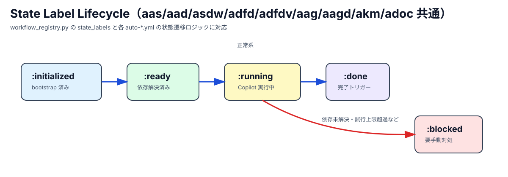
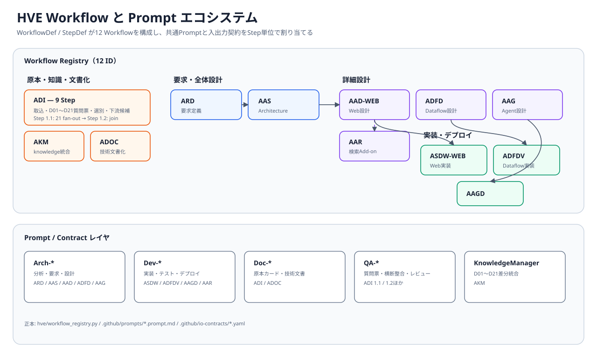

# ワークフロー・ラベル・Prompt リファレンス

← [README](../README.md)

> **対象読者**: GitHub Actions / Issue Template / `hve` CLI の関係を俯瞰したい利用者・運用担当者  
> **前提**: `.github/workflows/`、`.github/ISSUE_TEMPLATE/`、`hve/workflow_registry.py`、`hve/__main__.py` を参照できること  
> **次のステップ**: ローカル実行は [hve-cli-orchestrator-guide.md](./hve-cli-orchestrator-guide.md)、Self-hosted Runner の実運用は [setup-self-hosted-runner.md](./setup-self-hosted-runner.md) を参照してください

---

## 目次

- [ワークフロー一覧](#ワークフロー一覧)
- [HVE CLI Orchestrator ワークフロー ID（逆引き）](#hve-cli-orchestrator-ワークフロー-id逆引き)
- [Cloud / Local 対応表（初回ユーザー向け）](#cloud--local-対応表初回ユーザー向け)
- [ワークフロー必須入力ファイル一覧](#ワークフロー必須入力ファイル一覧)
- [ワークフロートリガー系ラベル](#ワークフロートリガー系ラベル)
- [モデル選択ルール](#モデル選択ルール)
- [SDK ツール制限（環境変数）](#sdk-ツール制限環境変数)
- [Prompt 一覧](#prompt-一覧)
- [knowledge/ ディレクトリとの関係](#knowledge-ディレクトリとの関係)
- [Issue テンプレート一覧](#issue-テンプレート一覧)
- [Skills 一覧と Agent-Skills 対応](#skills-一覧と-agent-skills-対応)
- [APP-ID 指定方法](#app-id-指定方法)

---

## ワークフロー一覧

`.github/workflows/` 配下の workflow ファイルを、各ファイルの `name:` と `on:` から一覧化します。

> **件数について**: workflow ファイルは追加・削除されるため、本ガイドでは総数を固定値で断定しません。現在の総数は `.github/workflows/*.yml` の実体を数えて確認してください（PowerShell: `(Get-ChildItem .github/workflows/*.yml).Count` / bash: `ls .github/workflows/*.yml | wc -l`）。下表は 2026-08-07 時点の実体と一致しています。

| ファイル名 | Workflow 名 | Trigger |
|-----------|-------------|---------|
| `aas-timeout-monitor.yml` | AAS Timeout Monitor | `schedule` / `workflow_dispatch` |
| `advance-subissues.yml` | Advance Sub Issues | `pull_request: [closed]` / `issues: [labeled]` |
| `audit-plans.yml` | Audit all plan.md (scheduled) | `schedule` / `workflow_dispatch` |
| `auto-ai-agent-design-reusable.yml` | AAG: AI Agent Design (Reusable) | `workflow_call` |
| `auto-ai-agent-dev-reusable.yml` | AAGD: AI Agent Dev & Deploy (Reusable) | `workflow_call` |
| `auto-akm-after-qa.yml` | QA Answered AKM Coordinator（回答済み QA を AKM へ非待機同期） | `workflow_dispatch` |
| `auto-app-detail-design-web-reusable.yml` | AAD-WEB: Web App Design (Reusable) | `workflow_call` |
| `auto-app-dev-microservice-web-reusable.yml` | ASDW-WEB: Web App Dev & Deploy (Reusable) | `workflow_call`（**dispatcher からの呼び出しは停止中 / FR-CLOUD-06**）|
| `auto-app-documentation-reusable.yml` | ADOC Orchestrator | `workflow_call` |
| `auto-app-selection-reusable.yml` | AAS Orchestrator | `workflow_call` |
| `auto-approve-and-merge.yml` | PR 自動 Approve & Auto-merge | `pull_request_target: [labeled, ready_for_review, synchronize, edited]` |
| `auto-blocked-to-human-required.yml` | Auto Blocked to Human Required | `schedule` / `workflow_dispatch` |
| `auto-create-subissues-transition.yml` | タスク完了 → create-subissues 自動付与（split-mode 専用） | `workflow_call` |
| `auto-dataflow-design-reusable.yml` | ADFD Orchestrator | `workflow_call` |
| `auto-dataflow-dev-reusable.yml` | ADFDV Orchestrator | `workflow_call` |
| `auto-draft-to-ready.yml` | Draft PR 自動 Ready 化 | `pull_request_target: [synchronize, labeled]` |
| `auto-human-resolved-to-ready.yml` | Human Resolved to Ready Transition | `issues: [labeled]` |
| `auto-issue-qa-ready-transition.yml` | Issue QA-Ready to Ready Transition | `issue_comment: [created]` / `pull_request_target: [opened]` / `workflow_dispatch` |
| `auto-knowledge-management-reusable.yml` | AKM Orchestrator | `workflow_call` |
| `auto-orchestrator-dispatcher.yml` | HVE Cloud Agent Orchestrator Dispatcher | `issues: [opened, labeled, closed]` |
| `auto-pr-transition-dispatcher.yml` | PR Transition Dispatcher | `pull_request_target: [synchronize, labeled]` / `issue_comment: [created]` |
| `auto-qa-default-answer.yml` | QA 質問票デフォルト回答の自動投稿 | `issue_comment: [created]` |
| `auto-qa-timeout-watcher.yml` | Auto QA Timeout Watcher | `schedule` / `workflow_dispatch` |
| `auto-qa-to-review-transition.yml` | QA 完了 → adversarial-review 自動遷移 | `workflow_call` |
| `auto-review-to-approve-transition.yml` | レビュー完了 → auto-approve-ready 自動遷移 | `workflow_call` |
| `auto-self-improve-close.yml` | Self-Improve Auto Close | `pull_request: [closed]` |
| `bats-tests.yml` | Bats Tests | `pull_request`（`src/infra/azure/**` 等の path filter あり） |
| `check-auto-qa-skip-reusable.yml` | Check Auto-QA Skip (Reusable) | `workflow_call` |
| `copilot-auto-feedback.yml` | Copilot Auto Feedback | `pull_request_target: [opened, edited, labeled, ready_for_review]` / `issues: [labeled]` / `workflow_dispatch` |
| `create-subissues-from-pr.yml` | Create Sub Issues from PR | `pull_request: [labeled]` |
| `detect-qa-questionnaire-pr.yml` | Detect QA Questionnaire PR | `pull_request_target: [opened, synchronize]` |
| `e2e-playwright-reusable.yml` | E2E Playwright (Reusable) | `workflow_call` |
| `label-consistency-audit.yml` | Label Consistency Audit | `schedule` / `workflow_dispatch` / `issues: [labeled, unlabeled, closed]` |
| `link-copilot-pr-to-issue.yml` | Copilot PR body への Closes #N 自動補完 | `pull_request_target: [opened, ready_for_review]` |
| `mdq-index-reusable.yml` | mdq-index (reusable) | `workflow_call` |
| `plan-validation-and-labeling.yml` | Plan Validation and Labeling | `pull_request`（`work/**/plan.md` の path filter あり） |
| `post-qa-to-pr-comment.yml` | QA 質問票 → PR コメント自動展開 | `pull_request_target: [synchronize]` |
| `protect-readonly-paths.yml` | Protect Read-Only Paths | `pull_request` |
| `restore-auto-qa-label.yml` | Restore auto-qa label | `pull_request_target: [labeled, unlabeled, synchronize]` / `workflow_dispatch` |
| `rollback-drill.yml` | Rollback Drill | `workflow_dispatch` |
| `self-hosted-runner-smoke-test.yml` | self-hosted-runner-smoke-test | `workflow_dispatch` |
| `setup-labels.yml` | Setup Labels | `workflow_dispatch` / `workflow_call` |
| `state-transition-on-pr-merge.yml` | State Transition on PR Merge | `pull_request_target: [closed]` |
| `sync-azure-skills.yml` | Sync Azure Skills | `workflow_dispatch`（`schedule` はコメントアウト済み） |
| `sync-issue-labels-to-pr.yml` | Issue ラベル → PR 自動同期 | `pull_request_target: [opened, ready_for_review]` |
| `tdd-retry-metrics.yml` | TDD Retry Metrics Dashboard | `schedule` / `workflow_dispatch` |
| `test-cli-scripts.yml` | Test CLI Scripts (Bash / PowerShell) | `push` / `pull_request`（path filter あり） |
| `test-hve-python.yml` | Test HVE Python | `push` / `pull_request`（path filter あり） |
| `validate-hve-requirement-traceability.yml` | HVE Requirement Traceability | `pull_request: [opened, synchronize, reopened, edited, ready_for_review]` |
| `validate-hve-requirement-traceability-trusted.yml` | HVE Requirement Traceability Trusted | `pull_request_target: [opened, synchronize, reopened, edited, ready_for_review]` |
| `validate-io-contract.yml` | Validate io-contracts | `pull_request` / `push`（`.github/io-contracts/**`・`hve/workflow_registry.py` 等の path filter あり） |
| `validate-knowledge.yml` | Validate knowledge/ Files | `pull_request` / `push` / `workflow_dispatch` |
| `validate-skills.yml` | Validate Skills | `pull_request` / `workflow_dispatch` |
| `validate-subissues.yml` | Validate subissues.md format | `pull_request: [opened, synchronize, reopened]` |
| `verify-qa-reference-in-pr.yml` | Verify QA Reference in PR | `pull_request_target: [opened, edited, synchronize, ready_for_review, reopened, labeled]` / `workflow_dispatch` |

> **運用メモ**: オーケストレーション系 reusable workflow は `workflow_call` で呼び出されます。少なくとも `auto-app-dev-microservice-web-reusable.yml` / `auto-dataflow-dev-reusable.yml` / `auto-ai-agent-dev-reusable.yml` では `runner_type` 入力により `ubuntu-latest` と `[self-hosted, linux, x64, aca]` を切り替えます。
>
> **FR-CLOUD-06**: `auto-app-dev-microservice-web-reusable.yml` は `hve/workflow_registry.py` の ASDW-WEB Step 体系と非同期（冒頭に `OUT-OF-SYNC NOTICE` を自己申告）のため、`auto-orchestrator-dispatcher.yml` からの起動を停止しています。ファイル自体は残存しますが dispatcher からは `uses:` されません。ASDW-WEB は **CLI 経路 / GUI 経路が supported** です。

### HVE CLI Orchestrator ワークフロー ID（逆引き）

| ワークフロー ID | 対応ワークフロー | GitHub ワークフローファイル |
|--------------|--------------|--------------------------|
| `ard` | Auto Requirement Definition | なし（`hve` ローカル実行専用） |
| `aas` | App Architecture Design | `auto-app-selection-reusable.yml` |
| `aad` / `aad-web` | Web App Design | `auto-app-detail-design-web-reusable.yml` |
| `asdw` / `asdw-web` | Web App Dev & Deploy | `auto-app-dev-microservice-web-reusable.yml`（**Cloud 起動停止中 / FR-CLOUD-06。CLI / GUI 経路が supported**）|
| `adfd` | Dataflow Design | `auto-dataflow-design-reusable.yml` |
| `adfdv` | Dataflow Dev | `auto-dataflow-dev-reusable.yml` |
| `aag` | AI Agent Design | `auto-ai-agent-design-reusable.yml`（dispatcher 経由） |
| `aagd` | AI Agent Dev & Deploy | `auto-ai-agent-dev-reusable.yml`（dispatcher 経由） |
| `akm` | Knowledge Management（QA + original-docs + Work IQ） | `auto-knowledge-management-reusable.yml` |
| `adoc` | Source Codeからのドキュメント作成 | `auto-app-documentation-reusable.yml` |
| `adi` | Auto Design-doc Ingestion | なし（`hve` ローカル実行専用） |

> **注意**: HVE CLI Orchestrator のコマンドで `--workflow asd` は無効です。正しいワークフロー ID は上記の `ard` / `aas` / `aad-web` / `asdw-web` / `adfd` / `adfdv` / `aag` / `aagd` / `akm` / `adoc` / `adi` を使用してください（`aad`/`asdw` はエイリアスとして使用可能）。
>
> `ard` / `adi` は GitHub Actions ワークフローファイルを持たず、`python -m hve orchestrate --workflow <id>` によるローカル実行専用です。
>
> `akm` / `adoc` / `adi` は本リポジトリの中核的特徴（`knowledge/` を介した要求定義一元管理）を担うワークフローです。

#### ARD ステップ一覧

| Step ID | タイトル | Prompt | 任意/必須 | 主要出力 |
|---|---|---|---|---|
| 1 | 事業分野候補列挙 | `Arch-ARD-BusinessAnalysis-Untargeted` | 必須（グループ 1） | `docs/company-business-recommendation.md` |
| 1.1 | 事業分野別深掘り分析（fan-out: `business_candidate`） | 同上 | 必須（グループ 1） | `docs/business/{key}-analysis.md` |
| 1.2 | 事業分析統合 | 同上 | 必須（グループ 1） | `docs/company-business-requirement.md` |
| 2 | 対象業務深掘り分析 | `Arch-ARD-BusinessAnalysis-Targeted` | 必須（グループ 2） | `docs/business-requirement.md` |
| **2.1** | **KPI/OKR 定義（任意）** | **`Arch-ARD-KPIOKRDefinition`** | **任意（オプトイン）** | **`docs/recommended-kpi-okr.md`** |
| 3.1 | ユースケース骨格抽出 | `Arch-ARD-UseCaseCatalog` | 必須（グループ 4） | `docs/catalog/use-case-skeleton.md` |
| 3.2 | ユースケース詳細生成（fan-out: `use_case_skeleton`） | 同上 | 必須（グループ 4） | `docs/usecase/{key}-detail.md` |
| 3.3 | ユースケースカタログ統合 | 同上 | 必須（グループ 4） | `docs/catalog/use-case-catalog.md` |

> Step 2.1 は CLI `--include-kpi-okr` / GUI チェックボックス / 対話ウィザードのいずれかで明示有効化した場合のみ実行されます（既定 OFF）。後続 Step 3.1/3.2 および `aas` の `Arch-ApplicationAnalytics` が任意参照します。
>
> Step ID は `hve/workflow_registry.py` の ARD `StepDef` を一次根拠としています。上記 8 Step は 4 表示グループ（1 / 2 / 3 / 4）に集約して提示されます。展開規則の正本は `hve/workflow_registry.py` の `_WORKFLOW_GROUP_MAPS["ard"]` です（`1` → `1`/`1.1`/`1.2`、`2` → `2`、`3` → `2.1`、`4` → `3.1`/`3.2`/`3.3`）。

### Cloud / Local 対応表（初回ユーザー向け）

- **HVE Cloud Agent Orchestrator**: GitHub Issue の label / state を起点に、`auto-orchestrator-dispatcher.yml`（`name: HVE Cloud Agent Orchestrator Dispatcher`）が対象を判定し、`workflow_call` の reusable workflow を呼び出す経路です。
- **HVE CLI Orchestrator**: PC / Mac / 仮想マシン上で `python -m hve`（または `python -m hve orchestrate --workflow <id>`）から実行する経路です。

| Workflow ID | HVE Cloud Agent Orchestrator | HVE CLI Orchestrator | 備考 |
|---|---|---|---|
| `ard` | ❌ | ✅ | `hve/workflow_registry.py` の canonical workflow。dispatcher の `trigger_map` / `done_map` / `closed_prefix_map` に含まれず、Issue label 経路では起動しません（local 専用）。 |
| `aas` | ✅ | ✅ | Cloud では `auto-app-selection` ラベルで dispatcher が `AAS` を選択。 |
| `aad-web` | ✅ | ✅ | Cloud では `auto-app-detail-design-web` ラベルで dispatcher が `AAD-WEB` を選択。 |
| `asdw-web` | ⚠️ | ✅ | dispatcher の `trigger_map` には `auto-app-dev-microservice-web` が残っていますが、`auto-app-dev-microservice-web-reusable.yml` は `uses:` されておらず、Cloud 起動は停止中です（FR-CLOUD-06）。CLI / GUI 経路が supported。 |
| `adfd` | ✅ | ✅ | Cloud では `auto-dataflow-design` ラベルで dispatcher が `ADFD` を選択。 |
| `adfdv` | ✅ | ✅ | Cloud では `auto-dataflow-dev` ラベルで dispatcher が `ADFDV` を選択。 |
| `aag` | ✅ | ✅ | Cloud では `auto-ai-agent-design` ラベルで dispatcher が `AAG` を選択。 |
| `aagd` | ✅ | ✅ | Cloud では `auto-ai-agent-dev` ラベルで dispatcher が `AAGD` を選択。 |
| `akm` | ✅ | ✅ | Cloud では `knowledge-management` ラベルで dispatcher が `AKM` を選択。 |
| `adoc` | ✅ | ✅ | Cloud では `auto-app-documentation` ラベルで dispatcher が `ADOC` を選択。 |
| `adi` | ❌ | ✅ | 原本の目録化・選別に加え、Step 1.1のD01〜D21質問票21並列生成とStep 1.2の横断joinを行うcanonical workflow。Issue Template / dispatcher経路は持たない（local専用）。 |
| `aar` | ❌ | ✅ | `hve/workflow_registry.py` の canonical workflow（Agentic Retrieval Add-on）。dispatcher の `trigger_map` に含まれず、Issue label 経路では起動しません（local 専用）。 |

#### canonical workflow ID と alias（`hve/workflow_registry.py`）

`hve/workflow_registry.py` の `_ALIASES` では、以下のみが実装されています。

| alias | canonical workflow ID | 補足 |
|---|---|---|
| `aad` | `aad-web` | `get_workflow()` で canonical ID に解決して実行。Cloud 側の後方互換は一部のみで、`aad:qa-ready` / `aad:done` / タイトル接頭辞 `[AAD]` / 旧トリガーラベル `auto-app-detail-design` が対象です。 |
| `asdw` | `asdw-web` | `get_workflow()` で canonical ID に解決して実行。Cloud 側の後方互換は一部のみで、`asdw:qa-ready` / `asdw:done` / タイトル接頭辞 `[ASDW]` / 旧トリガーラベル `auto-app-dev-microservice` が対象です。 |

> このガイドでは、実装で確認できた alias のみ記載しています（未確認 alias は記載しません）。

#### 初回ユーザー向け注意

- GitHub.com の Issue Template から起動する場合は、**HVE Cloud Agent Orchestrator 対応 workflow**（上表で HVE Cloud Agent Orchestrator 列が ✅）を選択してください。
- ローカルで `python -m hve` から起動する場合は、`hve/workflow_registry.py` に登録された workflow ID を使用してください。
- `ard` / `adi` / `aar` は **HVE CLI / GUI Orchestrator 専用** です。HVE Cloud Agent Orchestrator のIssue label / dispatcher経路では実行できません。
- alias（`aad`, `asdw`）は HVE CLI Orchestrator で canonical ID（`aad-web`, `asdw-web`）に解決されます。workflow ID の記載時は canonical ID と混同しないでください。

### Work IQ 連携（オプション）

`--auto-qa` と `--workiq` が有効な場合のみ、QA フェーズで M365 補助情報を読み取り専用で参照します（未インストール時は自動スキップ）。Phase 1 の本処理、Review フェーズ、自己改善フェーズでは Work IQ を使用しません。

- **QA（`--auto-qa`）**:  
  - 通常モード: 質問票から要約した問いを一括で問い合わせ、`qa/{run_id}-{step_id}-workiq-qa.md` を生成
  - ドラフトモード（`--workiq-draft`）: 質問ごとに問い合わせ、`qa/{run_id}-{step_id}-workiq-qa-draft.md` を生成
- wizard モード（`python -m hve`）では、QA 自動投入を有効にした場合のみ Work IQ 有効化メニューが表示されます。ログイン成功後に「Work IQ (Microsoft 365 Copilot) の末尾に追加するプロンプト」を入力すると、QA フェーズの Work IQ プロンプトへ追記できます。

利用ツール（読み取り専用）:
- `ask_work_iq`

---

## ワークフロー必須入力ファイル一覧

下表は、`hve/workflow_registry.py` の `FULL_PIPELINE.dependencies` と `ARTIFACT_DESCRIPTIONS` が定義する**ワークフロー間の成果物依存**です。前段ワークフローを実行済みか、当該ファイルを手動配置しておく必要があります。

> **GUI の precheck との関係（重要）**: `hve gui` の Step 1 → Step 2 遷移時 precheck は、上記の全依存を網羅検査しません。現行実装（`hve/autopilot/precheck_runner.py` の `run_step1_precheck()` → `hve/gui/workflow_step_requirements.py` の `summarize_all_requirements_for_selection()`）が評価するのは次の 2 系統だけです。ファイル要件（`REQUIREMENT_TABLE` 由来）は **最優先ワークフローの全選択 Step** のみ、パラメータ要件（`StepDef.required_params` 由来）は **全選択ワークフローの全選択 Step** です。下流ワークフローのファイル要件は同一セッション内の上流が生成するため検査しません。旧版にあった全ステップ網羅検査（`precheck_collector`）、Workflow 固有設定検査（`precheck_settings.collect_missing_workflow_settings`）、Wizard Step 2 入力検査、**追加プロンプトによる override**、LLM 自然言語判定、AUTH カテゴリは撤去済みです（`precheck_runner.py` の v2 改訂 docstring に明記）。したがって「追加プロンプトに文書名やパスを書けば precheck を通過する」という運用は**現在は成立しません**。
>
> **ARD の例外**: グループ `1` を併せて選択している場合、グループ `2` の `target_business` は precheck 対象外です。当該経路では Step 1.2 完了後に Strategic Recommendation から自動生成されるためです。

定義の出典: [`hve/workflow_registry.py`](../hve/workflow_registry.py) の `FULL_PIPELINE.dependencies` および `ARTIFACT_DESCRIPTIONS`。

| ワークフロー ID | ワークフロー名 | 必須入力文書名（説明文） | ファイルパス | soft |
|---|---|---|---|---|
| `aas` | Architecture Design | （なし） | — | — |
| `aad-web` | Web App Design | アプリケーションカタログ | `docs/catalog/app-catalog.md` | required |
| `aad-web` | Web App Design | ドメイン分析 | `docs/catalog/domain-analytics.md` | required |
| `aad-web` | Web App Design | サービスカタログ | `docs/catalog/service-catalog.md` | required |
| `aad-web` | Web App Design | データモデル | `docs/catalog/data-model.md` | required |
| `aad-web` | Web App Design | サービスカタログマトリクス | `docs/catalog/service-catalog-matrix.md` | required |
| `aad-web` | Web App Design | TDD テスト戦略 | `docs/catalog/test-strategy.md` | required |
| `asdw-web` | Web App Dev & Deploy | 画面定義書（一覧） | `docs/screen/*.md` | required |
| `asdw-web` | Web App Dev & Deploy | サービス定義書（一覧） | `docs/services/*.md` | required |
| `asdw-web` | Web App Dev & Deploy | TDD テスト仕様書（一覧） | `docs/test-specs/*-test-spec.md` | required |
| `adfd` | Dataflow Design | アプリケーションカタログ | `docs/catalog/app-catalog.md` | soft |
| `adfd` | Dataflow Design | ドメイン分析 | `docs/catalog/domain-analytics.md` | soft |
| `adfdv` | Dataflow Dev | バッチドメイン分析 | `docs/dataflow/dataflow-domain-analytics.md` | required |
| `adfdv` | Dataflow Dev | バッチデータモデル | `docs/dataflow/dataflow-data-model.md` | required |
| `adfdv` | Dataflow Dev | データフローアプリカタログ | `docs/dataflow/dataflow-app-catalog.md` | required |
| `adfdv` | Dataflow Dev | バッチサービスカタログ | `docs/dataflow/dataflow-service-catalog.md` | required |
| `adfdv` | Dataflow Dev | データフローテスト戦略 | `docs/dataflow/dataflow-test-strategy.md` | required |
| `adfdv` | Dataflow Dev | データフローアプリ詳細仕様書（一覧） | `docs/dataflow/apps/*.md` | required |
| `adfdv` | Dataflow Dev | TDD テスト仕様書（一覧） | `docs/test-specs/*-test-spec.md` | required |
| `aag` | AI Agent Design | サービスカタログ | `docs/catalog/service-catalog.md` | required |
| `aag` | AI Agent Design | 画面定義書（一覧） | `docs/screen/*.md` | required |
| `aag` | AI Agent Design | サービス定義書（一覧） | `docs/services/*.md` | required |
| `aag` | AI Agent Design | TDD テスト仕様書（一覧） | `docs/test-specs/*-test-spec.md` | required |
| `aagd` | AI Agent Dev & Deploy | AI Agent 設計書（一覧） | `docs/agent/*.md` | required |
| `aagd` | AI Agent Dev & Deploy | （`asdw-web` への soft 依存。必須成果物の指定なし） | — | soft |

### GUI precheck が実際に検査する項目（`hve/gui/workflow_step_requirements.py` の `REQUIREMENT_TABLE`）

| ワークフロー ID | 評価ステップ | 必須入力値 | 必須ファイル |
|---|---|---|---|
| `ard` | `1` | `company_name` | — |
| `ard` | `2` | `target_business` | — |
| `ard` | `3` / `4` | — | `docs/business-requirement.md` |
| `aas` | `1` | — | `docs/catalog/use-case-catalog.md` |
| `aad-web` | `1` | — | `docs/catalog/app-catalog.md` |
| `asdw-web` | `1.1` | `resource_group` | `docs/catalog/app-catalog.md` |
| `adfd` | `6.1` / `6.2` | — | `docs/catalog/app-catalog.md` |
| `adfdv` | `1.1` | `resource_group` | `docs/dataflow/dataflow-app-catalog.md` |
| `aag` | `1` | — | `docs/catalog/app-catalog.md` |
| `aagd` | `1` | `resource_group` | `docs/catalog/app-catalog.md` |
| `aar` | `1` | — | `docs/catalog/app-catalog.md` |
| `akm` | `1` | — | `docs-original/` または `qa/`（いずれか） |
| `adi` | `1` | — | `docs-original/` |
| `adoc` | `1` | `target_dirs` | — |
| Autopilot（仮想 WF） | — | — | Autopilot カタログ（既定 `docs/catalog/app-arch-catalog.md`） |

- Autopilot ON かつ `aad-web` / `asdw-web` / `adfd` / `adfdv` のいずれかが選択されている場合は、個別ワークフロー判定を行わず Autopilot 仮想ワークフロー 1 件（カタログファイル存在チェック）のみを評価します。
- precheck の結果は warn 項目のみが `AutopilotPrecheckResult` に格納され、ブロッキングではなく警告として提示されます。
- 旧 `hve/gui/artifact_precheck.py` の判定ロジックは廃止され、Autopilot ON/OFF いずれの経路も上記の共通入口に統一されています。

---

## ARD: Auto Requirement Definition（要求定義の自動化）

| 項目 | 値 |
|---|---|
| ワークフロー ID | `ard` |
| 略称 | `ARD` |
| ラベルプレフィックス | `ard` |
| ウィザード表示順 | 1 番目 |
| ステップ数 | 8（`hve/workflow_registry.py` の実 `StepDef` 数。表示上は 4 グループ: 1 / 2 / 2.1 / 3） |
| 主な出力 | `docs/company-business-requirement.md`、`docs/catalog/use-case-catalog.md` |
| Work IQ 連携 | Step 2 のみ（条件付き） |

### ステップ DAG

- グループ 1（Step 1 → 1.1 → 1.2）: `target_business` 空のときのみ実行（Untargeted 事業分析）。Step 1.1 は `business_candidate` パーサで fan-out
- グループ 2（Step 2）: 常に実行（Targeted 事業分析）。グループ 1 完了時は SR-ID 選択 → `target_business` 自動生成を経由
- Step 2.1（KPI/OKR 定義）: 明示オプトイン時のみ実行（既定 OFF）
- グループ 3（Step 3.1 → 3.2 → 3.3）: グループ 2 完了で起動（UseCase 作成）。Step 3.2 は `use_case_skeleton` パーサで fan-out

### 詳細
詳細な使い方は [`01-business-requirement.md` の「要求定義の自動化（ARD: Auto Requirement Definition）」セクション](./01-business-requirement.md#要求定義の自動化ard-auto-requirement-definition) を参照してください。

---

## ワークフロートリガー系ラベル

以下のラベルを GitHub リポジトリに事前に作成してください。

| ラベル名 | 役割 |
|---------|------|
| `auto-app-selection` | **アプリケーションアーキテクチャ設計ワークフロー（AAS）の起動トリガー**。Issue にこのラベルが付与されると、AAS オーケストレーターが起動し、Sub Issue を自動生成して Copilot にアサインする |
| `auto-app-detail-design-web` | **Web App Design（AAD-WEB）の起動トリガー**。Issue にこのラベルが付与されると、AAD-WEB オーケストレーターが起動し、Sub Issue を自動生成して Copilot にアサインする。旧ラベル `auto-app-detail-design` も dispatcher が後方互換で受け付けます。 |
| `auto-app-dev-microservice-web` | **Web App Dev & Deploy（ASDW-WEB）の起動トリガー**。Issue にこのラベルが付与されると、ASDW-WEB オーケストレーターが起動し、Sub Issue を自動生成して Copilot にアサインする。旧ラベル `auto-app-dev-microservice` も dispatcher が後方互換で受け付けます。 |
| `auto-dataflow-design` | **データフロー設計ワークフロー（ADFD）の起動トリガー**。Issue にこのラベルが付与されると、ADFD オーケストレーターが起動し、Step.1〜3 の Sub Issue を自動生成して Copilot にアサインする |
| `auto-dataflow-dev` | **バッチ実装ワークフロー（ADFDV）の起動トリガー**。Issue にこのラベルが付与されると、ADFDV オーケストレーターが起動し、Step.1〜4 の Sub Issue を自動生成して Copilot にアサインする |
| `auto-app-documentation` | **Source Codeからのドキュメント作成ワークフロー（ADOC）の起動トリガー**。Issue にこのラベルが付与されると、ADOC オーケストレーターが起動し、Step.1〜6 の Sub Issue を自動生成して Copilot にアサインする |
| `knowledge-management` | **Knowledge Management ワークフロー（AKM）の起動トリガー**。Issue にこのラベルが付与されると、AKM オーケストレーターが起動し、`[AKM] Step.1: knowledge/ ドキュメント生成・管理` Sub Issue を自動生成して `KnowledgeManager` Agent で Copilot にアサインする。sources（qa/original-docs/both）は Issue Template で選択する（HVE Cloud Agent はこの 3 選択のみ）。`hve` ローカル CLI を使うと `workiq` をさらにマルチ選択で追加できる（例: `--sources qa,original-docs,workiq`）。 |
| `qa-akm-sync` | **QA 回答起点の AKM 実行を識別するラベル**。`auto-akm-after-qa.yml` が作成する AKM Root Issue と、その Step Issue に付与される。このラベルを持つ AKM だけが `akm-qa-sync-child-<repo>` の concurrency で直列化され、調整ワークフローが保持する `akm-knowledge-write-<repo>` との自己デッドロックを回避する |
| `create-subissues` | **Sub Issue 自動作成のトリガー**。人間が PR にこのラベルを手動付与すると、PR 内の `work/**/subissues.md` をパースして Sub Issue を自動作成する |
| `setup-labels` | **ラベル初期セットアップのトリガー**。Issue にこのラベルが付与されると `.github/labels.json` に定義された全ラベルがリポジトリに自動作成・更新される。リポジトリ作成後に1度実行する想定だが、ラベル定義変更時は再実行可能（冪等設計）。Actions タブの `workflow_dispatch` からも手動実行可能。 |
| `split-mode` | **分割モード PR の識別ラベル**。`plan-validation-and-labeling.yml` の `label-split-mode` job が、PR 差分に含まれる `work/**/plan.md` の `<!-- split_decision: SPLIT_REQUIRED -->` を検知した場合に自動付与します。`check-split-mode` job は同 PR に実装ファイルが混在していないかを検証します。 |
| `plan-only` | **plan.md のみの PR 識別ラベル**。`plan-validation-and-labeling.yml` の `label-split-mode` job が `split-mode` と同時に付与します。plan.md / subissues.md 中心の PR であることを示します。 |
| `adversarial-review` | **Copilot 敵対的レビューのトリガー**（`.github/labels.json` の説明: "explicit adversarial review trigger for Copilot review workflow"）。PR にこのラベルが付いた状態で PR が ready（非 draft）になると、Copilot に敵対的レビュー指示コメントを自動投稿する |
| `auto-context-review` | **コンテキスト質問票・設計確認の強制トリガー**（同説明: "force context questionnaire and design clarification"）。Agent はコンテキストが十分でも設計判断・技術選定・スコープの確認質問を行う |
| `auto-qa` | **Copilot 質問票作成のトリガー**。PR にこのラベルが付いた状態で PR が ready（非 draft）になると、Copilot に選択式の質問票作成指示コメントを自動投稿する |
| `auto-approve-ready` | **PR 自動 Approve & Auto-merge のトリガー**。PR にこのラベルが付いた状態で PR が ready（非 draft, 非 split-mode）になると、`auto-approve-and-merge.yml` が自動発火し、PR の Approve と squash merge を実行する。各オーケストレーターが `auto-merge: true` 設定時に自動付与する |
| `self-improve` | **自己改善ループの識別ラベル**。Issue テンプレートから Copilot を直接アサインして使用します。`auto-self-improve-close.yml` は、PR マージ時にこのラベルを持つ Issue を検知し、auto-merge 有効判定や Sub Issue 完了確認などの条件を満たした場合に自動クローズします（条件未達時はスキップされることがあります）。 |

> [!IMPORTANT]
> GitHub の Issue Template の `labels:` フィールドは、**リポジトリに既に存在するラベルのみ**を Issue に自動付与します。ラベルが存在しない場合、Issue 作成時にラベルの自動付与はサイレントにスキップされます。各ワークフローを使用する前に、必要なラベルを事前に作成してください。
> 特に、`plan-validation-and-labeling.yml` で使用する `split-mode` / `plan-only` ラベルも事前に存在している必要があります。**Setup Labels ワークフロー**（Actions タブ → Setup Labels → Run workflow）を実行すると、これらを含む上記の全ラベルを自動作成できます。必要に応じて、リポジトリ設定画面の **Settings → Labels** から手動作成することも可能です。
>
> **⚠️ 初回セットアップ時の注意（鶏と卵問題）:** 新規リポジトリには `setup-labels` ラベル自体がまだ存在しないため、Issue テンプレートからではなく **Actions タブから `Setup Labels` ワークフローを手動実行**する必要があります（Actions タブ → 左サイドバーの「Setup Labels」→「Run workflow」）。手動実行の前に **Settings → Actions → General → Workflow permissions** を「**Read and write permissions**」に設定してください。
>
> 詳細な手順は [hve-cloud-getting-started.md の Step.5](./hve-cloud-getting-started.md#step5-ラベル設定) を参照してください。

---

### ステートラベル（各オーケストレーターが自動管理）

以下のラベルは各オーケストレーターワークフローが自己 bootstrap（初回自動作成）し、状態遷移を管理します。
`labels.json`（Setup Labels）の管理対象外です。

| プレフィックス | ワークフロー | bootstrap 箇所 |
|-------------|------------|---------------|
| `aas:*` | `auto-app-selection-reusable.yml` | ワークフロー内 bootstrap ステップ |
| `aad-web:*` | `auto-app-detail-design-web-reusable.yml` | ワークフロー内 bootstrap ステップ |
| `asdw-web:*` | `auto-app-dev-microservice-web-reusable.yml` | ワークフロー内 bootstrap ステップ |
| `adfd:*` | `auto-dataflow-design-reusable.yml` | ワークフロー内 bootstrap ステップ |
| `adfdv:*` | `auto-dataflow-dev-reusable.yml` | ワークフロー内 bootstrap ステップ |
| `aag:*` | `auto-ai-agent-design-reusable.yml` | ワークフロー内 bootstrap ステップ |
| `aagd:*` | `auto-ai-agent-dev-reusable.yml` | ワークフロー内 bootstrap ステップ |
| `adoc:*` | `auto-app-documentation-reusable.yml` | ワークフロー内 bootstrap ステップ |
| `akm:*` | `auto-knowledge-management-reusable.yml` | ワークフロー内 bootstrap ステップ |

各プレフィックスには以下の状態があります:

| サフィックス | 意味 |
|------------|------|
| `:initialized` | 初期化開始済み（重複実行防止。Sub Issue 生成前に付与される場合あり） |
| `:qa-ready` | 事前 QA 完了待ち（`auto-qa` 有効時）。Copilot アサインは QA 回答後 |
| `:qa-drafting` | QA 質問票を作成中（Copilot アサイン済み）。質問票コメント確認後に `:qa-ready`（回答待ち）へ戻る |
| `:ready` | 実行待ち（依存解決済み、Copilot アサイン前） |
| `:running` | Copilot 実行中 |
| `:timeout` | `:running` 付与から既定 6 時間以上経過（AAS のみ `aas-timeout-monitor.yml` が自動付与。他プレフィックスは定義のみで自動付与ワークフローは未配線） |
| `:qa-timeout` | QA フェーズでタイムアウト（`auto-qa-timeout-watcher.yml` が付与） |
| `:done` | Step 完了（次 Step の起動トリガー） |
| `:blocked` | 実行継続不能（依存先未完了 / TDD リトライ上限超過 / Deploy 検証上限超過 等）（Copilot が自動付与） |
| `:human-required` | `:blocked` 付与から SLA（既定 24h）経過後に自動昇格。人間介入要請 |
| `:human-investigating` | 人間が原因調査・解決作業中（手動付与） |
| `:human-resolved` | 人間解決済み。付与すると `:ready` へ自動復帰（`auto-human-resolved-to-ready.yml` が起動） |



---

## モデル選択ルール

- 選択肢: `Auto` / `claude-opus-4.7` / `claude-opus-4.6` / `gpt-5.5` / `gpt-5.4`（5 種）
- `Auto` は GitHub が最適モデルを動的に選択（可用性・レイテンシ・レート制限・プラン/ポリシーを考慮）
- `Auto` 選択時はプレミアムリクエスト枠の消費が 0.9x（10% ディスカウント）
- プレミアム乗数 1x 超のモデルは `Auto` 対象外
- 空文字の場合は `Auto` として扱う
- 廃止モデル（`claude-sonnet-4.6` / `gpt-5.3-codex` / `gemini-2.5-pro`）を指定した場合は `Auto` に自動フォールバック（WARNING ログあり）
- Issue Template からも全モデル選択可（Phase 9+ で hve CLI `--model` とパリティ達成）
- Sub-Issue には `model/*` / `review-model/*` / `qa-model/*` ラベルでモデル指定を伝播
- `review_model` は hve CLI `--review-model` 相当。`Auto` 選択時は Copilot が最適モデルを自動選択（`SDKConfig.get_review_model()` は `Auto` をそのまま保持）
- `qa_model` は hve CLI `--qa-model` 相当。`Auto` 選択時は Copilot が最適モデルを自動選択（`SDKConfig.get_qa_model()` は `Auto` をそのまま保持）
- モデル ID は Copilot CLI の `/model` 表示に合わせてドット区切りを使用（例: `claude-opus-4.7`, `claude-opus-4.6`）
- `HVE_MODEL_OVERRIDE` 環境変数が設定されている場合はそちらが優先される
- 公式: https://docs.github.com/en/copilot/concepts/auto-model-selection

---

## SDK ツール制限（環境変数）

`hve` 起動時の環境変数で GitHub Copilot SDK の `available_tools` / `excluded_tools` を制御できる。
未設定時は SDK のデフォルト（全ツール許可）が適用される。

| 環境変数 | 形式 | 用途 |
|---|---|---|
| `HVE_AVAILABLE_TOOLS` | `tool1,tool2` または空白区切り | 指定したツールのみ許可（SDK `available_tools`） |
| `HVE_EXCLUDED_TOOLS` | `tool1,tool2` または空白区切り | 指定したツールを除外（SDK `excluded_tools`） |

- 区切り文字: カンマ (`,`) と空白の混在を許容（例: `"str_replace_editor, bash glob"` → 3 件）
- 空文字 / 未設定: `None` → SDK デフォルト
- 伝搬範囲: メインセッション・サブセッション（Pre-QA / Review）・`resume_session` の全経路
- 設定値は `SDKConfig.available_tools` / `SDKConfig.excluded_tools` に格納される

例:

```powershell
$env:HVE_AVAILABLE_TOOLS = "str_replace_editor,bash"
$env:HVE_EXCLUDED_TOOLS  = "web_search"
python -m hve aas --app-ids APP-01
```

---

## Fan-out 並列実行（ADR-0002）

並列度を最大化するため、各ステップを N 個のサブステップに自動展開する `fan-out` 機構を提供する（[ADR-0002](../template/decisions/ADR-0002-hve-fanout-architecture.md)）。

### 動作概要

- ベース StepDef に `fanout_static_keys` または `fanout_parser` を指定すると、`hve.dag_executor.DAGExecutor` が起動時に N 個の合成サブステップへ展開する。
- 合成サブステップの `step_id` は `{base_id}/{key}` 形式（例: `1/D01`、`2/APP-01`、`2.2/SVC-billing`）。
- 並列実行数は `WorkflowDef.max_parallel` でワークフロー単位に上書き可能（既定 `15`）。
- 動的解決パーサが 0 件を返した場合は自動 skip（`state="skipped", reason="fanout-empty"`）。
- 子ステップ 1 件でも失敗すると親 fan-out 元が `failed` とみなされ後続 DAG は起動しない。

### 設定方法

`hve/workflow_registry.py` の StepDef に以下を追加する:

```python
StepDef(
    id="1",
    title="...",
    custom_agent="KnowledgeManager",
    # --- fan-out 設定 ---
    fanout_static_keys=["D01", "D02", ..., "D21"],   # 静的キー
    # または
    fanout_parser="app_catalog",                      # 動的解決（hve/catalog_parsers.py 登録名）
    additional_prompt_template_path="hve/prompt/fanout/{wf}/_common.md",
    per_key_mcp_servers={                             # キー別 MCP 上書き（任意）
        "D08": {"sql-mcp": {"url": "..."}},
    },
)
```

### 登録済み動的解決パーサ（`hve/catalog_parsers.py`）

| パーサ名 | 主入力ファイル（`_PARSER_INPUT_PATHS`） | 抽出する ID 形式 |
|---|---|---|
| `app_catalog` | `docs/catalog/app-catalog.md` | `APP-NN` |
| `screen_catalog` | `docs/catalog/screen-catalog-APP-*.md`（glob） | `APP-NN-S###`（ファイル名の APP-ID と局所 `S###` の合成キー） |
| `service_catalog` | `docs/catalog/service-catalog.md` | `SVC-*` |
| `dataflow_catalog` | `docs/catalog/app-arch-catalog.md`（優先）→ `docs/catalog/app-catalog.md`（フォールバック） | `APP-NN` |
| `agent_catalog` | `docs/agent/agent-architecture.md`（優先）→ `docs/ai-agent-catalog.md` → `docs/agent/agent-application-definition.md` | `AGT-*` |
| `business_candidate` | `docs/company-business-recommendation.md` | `BIZ-NN` |
| `use_case_skeleton` | `docs/catalog/use-case-skeleton.md` | `UC-*` |

### 適用済みワークフロー（`hve/workflow_registry.py` の `fanout_parser` / `fanout_static_keys` から 2026-08-07 時点で抽出）

| WF | 対象ステップ（`fanout_static_keys` / `fanout_parser`） | 並列数 | 横断レビュー（join） |
|---|---|---|---|
| ARD | `1.1`（`business_candidate`）、`3.2`（`use_case_skeleton`） | 事業分野候補数 / UC 数 | Step `1.2` / `3.3`（統合） |
| AKM | `1`（静的キー D01〜D21） | 21 | Step `2`（`QA-DocConsistency`） |
| ADI | `1.1`（静的キー D01〜D21） | 21 | Step `1.2`（`QA-DocConsistency`） |
| AAS | `2`（`app_catalog`） | APP 数 | — |
| AAD-WEB | `1` / `2.1` / `2.2` / `2.3` / `2.4` / `2.6` | APP / 画面 / サービス数 | Step `3`（`QA-DocConsistency`） |
| ASDW-WEB | `2.5` / `3.2` / `3.3`（per-service）、`4.1` / `4.2`（per-screen） | サービス / 画面数 | — |
| ADFD | `1` / `3`（`dataflow_catalog`） | APP 数 | — |
| ADFDV | `2.1` / `2.2`（`dataflow_catalog`） | APP 数 | — |
| AAG | `3`（`agent_catalog`） | エージェント数 | — |
| AAGD | `2.1` / `2.2` / `2.3` / `3` / `4`（`agent_catalog`） | エージェント数 | — |
| AAR | `1` / `2` / `3` / `6`（`service_catalog`） | サービス数 | — |

> **ADOC は fan-out 対象外**（[ADR-0002](../template/decisions/ADR-0002-hve-fanout-architecture.md) H-1 / O-1）。ARD は ADR-0002 の O-1 で当初「対象外」と決定されましたが、[ADR-0003](../template/decisions/ADR-0003-ard-fanout-architecture.md) による再評価を経て `1.1` / `3.2` に fan-out が実装されています（`hve/catalog_parsers.py` の `business_candidate` / `use_case_skeleton`）。
>
> `max_parallel` はワークフロー単位で上書きされます（既定 `15`）。実装値: ARD `15` / AKM `21` / ADI `21` / ASDW-WEB `1`（直列化）。その他は既定値です。

### per-key プロンプトテンプレート規約

- パス規約: `hve/prompt/fanout/{workflow_id}/_common.md`
- 本文中の `{{key}}` は実行時に fan-out キー（例 `D01`）に置換される。
- ファイル不在時は警告のみ出してベースプロンプトをそのまま使用する。

### サブタスク起動の可視化（stderr JSON）

`Console._emit_structured()` により、verbosity / quiet 設定に関わらず **stderr** へ機械可読 JSON 1 行を必ず出力する。

スキーマ:

```json
{
  "event": "step_start",
  "step_id": "1/D01",
  "title": "knowledge/ ドキュメント生成・管理 (D01)",
  "agent": "KnowledgeManager",
  "ts": "2026-05-11T12:34:56.789Z",
  "run_id": "hve-20260511-abc",
  "parent_step_id": "1",
  "fanout_key": "D01"
}
```

イベント種別: `step_start` / `step_end` / `phase_start` / `phase_end` / `dag_wave_start` / `token_chunk`。

### Resume との連携

- 合成 step_id `1/D01` は `make_session_id()` 内で `/` → `-` に正規化され、決定論的 session_id `hve-{run_id}-step-1-D01` を生成する。
- 既存 `--resume` 経路でそのまま `resume_session()` 可能（同一キーが再評価される）。

---

## Prompt 一覧

`.github/prompts/` 配下の **84** Prompt（`README.md` を除く）を、ファイル名ベースのカテゴリと `hve/workflow_registry.py` の実際の割当で整理します。

### 全体俯瞰図



### ワークフロー別チェーン図

- AAS: [chain-aas.svg](./images/chain-aas.svg)
- AAD-WEB: [chain-aad-web.svg](./images/chain-aad-web.svg)
- ASDW-WEB: [chain-asdw.svg](./images/chain-asdw.svg)
- ADFD: [chain-adfd.svg](./images/chain-adfd.svg)
- ADFDV: [chain-adfdv.svg](./images/chain-adfdv.svg)
- AAG: [chain-aag.svg](./images/chain-aag.svg)
- AAGD: [chain-aagd.svg](./images/chain-aagd.svg)
- AKM: [chain-akm.svg](./images/chain-akm.svg)
- ADI: [00-design-doc-ingestion.md のAgentチェーン図](./00-design-doc-ingestion.md#agent-チェーン図adi)
- ADOC: [chain-adoc.svg](./images/chain-adoc.svg)
- Self-Improve: [chain-self-improve.svg](./images/chain-self-improve.svg)
- Workflow interconnection: [workflow-interconnection.svg](./images/workflow-interconnection.svg)

### カテゴリ別件数（`.github/prompts/*.prompt.md` 実体ベース）

| カテゴリ | ファイル名 prefix | 件数 |
|---------|---|-----:|
| ビジネス分析・要求定義 | `Arch-ApplicationAnalytics` / `Arch-ArchitectureCandidateAnalyzer` | 2 |
| アーキテクチャ設計 | `Arch-*`（上記 2 件を除く） | 28 |
| 実装 | `Dev-*` | 26 |
| ドキュメント生成 | `Doc-*` | 19 |
| QA / レビュー | `QA-*` | 7 |
| Knowledge Management | `KnowledgeManager` | 1 |
| E2E テスト | `E2ETesting-*` | 1 |
| **合計** | | **84** |

### ワークフローごとの実行 Agent（`hve/workflow_registry.py` の `list_workflows()` から 2026-08-07 時点で抽出）

| Workflow ID | 名称 | Step 数 | 実行 Agent |
|-------------|------|--------:|------------|
| `ard` | Auto Requirement Definition | 8 | `1`: `Arch-ARD-BusinessAnalysis-Untargeted`<br>`1.1`: `Arch-ARD-BusinessAnalysis-Untargeted`<br>`1.2`: `Arch-ARD-BusinessAnalysis-Untargeted`<br>`2`: `Arch-ARD-BusinessAnalysis-Targeted`<br>`2.1`: `Arch-ARD-KPIOKRDefinition`<br>`3.1`: `Arch-ARD-UseCaseCatalog`<br>`3.2`: `Arch-ARD-UseCaseCatalog`<br>`3.3`: `Arch-ARD-UseCaseCatalog` |
| `aas` | Architecture Design | 11 | `1`: `Arch-ApplicationAnalytics`<br>`2`: `Arch-ArchitectureCandidateAnalyzer`<br>`3.1`: `Arch-Microservice-DomainAnalytics`<br>`3.2`: `Arch-Microservice-ServiceIdentify`<br>`4.1`: `Arch-DataModeling`<br>`4.2`: `Arch-DataModeling`<br>`5`: `Arch-DataCatalog`<br>`6`: `Arch-Microservice-ServiceCatalog`<br>`7`: `Arch-TDD-TestStrategy`<br>`8`: `Arch-PersonaCatalog`<br>`9`: `Arch-UI-PersonaScreenList` |
| `aad-web` | Web App Design | 8 | `1`: `Arch-UI-List`<br>`2.1`: `Arch-UI-Detail`<br>`2.2`: `Arch-Microservice-ServiceDetail`<br>`2.3`: `Arch-TDD-TestSpec`<br>`2.4`: `Arch-TDD-TestSpec`<br>`2.5`: `Dev-Microservice-Azure-AddServiceDesign`<br>`2.6`: `Arch-AgenticRetrieval-Detail`<br>`3`: `QA-DocConsistency` |
| `asdw-web` | Web App Dev & Deploy | 25 | `1`: （グループ見出し・Agent 割当なし）<br>`2`: （グループ見出し・Agent 割当なし）<br>`3`: （グループ見出し・Agent 割当なし）<br>`4`: （グループ見出し・Agent 割当なし）<br>`5`: （グループ見出し・Agent 割当なし）<br>`1.1`: `Dev-Microservice-Azure-DataDesign`<br>`1.2`: `Dev-Microservice-Azure-DataTestCoding`<br>`1.3`: `Dev-Microservice-Azure-DataDeploy`<br>`2.1`: `Dev-Microservice-Azure-AddServiceDesign`<br>`2.2`: `Dev-Microservice-Azure-AddServiceDeploy`<br>`2.3`: `Dev-Microservice-Azure-AddServiceTestCoding`<br>`2.4`: `Dev-Microservice-Azure-AddServiceTesting`<br>`2.5`: `Dev-Microservice-Azure-AgenticRetrievalDesign`<br>`2.6`: `Dev-Microservice-Azure-AgenticRetrievalDeploy`<br>`3.1`: `Dev-Microservice-Azure-ComputeDesign`<br>`3.2`: `Dev-Microservice-Azure-ServiceTestCoding`<br>`3.3`: `Dev-Microservice-Azure-ServiceCoding-AzureFunctions`<br>`3.4`: `Dev-Microservice-Azure-ComputeDeploy-AzureFunctions`<br>`3.5`: `Dev-Microservice-Azure-ComputePostDeployTest`<br>`4.1`: `Dev-Microservice-Azure-UITestCoding`<br>`4.2`: `Dev-Microservice-Azure-UICoding`<br>`4.3`: `Dev-Microservice-Azure-UIDeploy-AzureStaticWebApps`<br>`4.4`: `E2ETesting-Playwright`<br>`5.1`: `QA-AzureArchitectureReview`<br>`5.2`: `QA-AzureDependencyReview` |
| `adfd` | Dataflow Design | 7 | `0.1`: `Arch-Dataflow-DataModel`<br>`0.2`: `Arch-Dataflow-AppCatalog`<br>`4`: `Arch-Dataflow-ServiceCatalog`<br>`5`: `Arch-Dataflow-TestStrategy`<br>`1`: `Arch-Dataflow-AppSpec`<br>`2`: `Arch-Dataflow-MonitoringDesign`<br>`3`: `Arch-Dataflow-TDD-TestSpec` |
| `adfdv` | Dataflow Dev | 7 | `1.1`: `Dev-Dataflow-DataServiceSelect`<br>`1.2`: `Dev-Dataflow-DataDeploy`<br>`2.1`: `Dev-Dataflow-TestCoding`<br>`2.2`: `Dev-Dataflow-ServiceCoding`<br>`3`: `Dev-Dataflow-FunctionsDeploy`<br>`4.1`: `QA-AzureArchitectureReview`<br>`4.2`: `QA-AzureDependencyReview` |
| `aag` | AI Agent Design | 3 | `1`: `Arch-AIAgentDesign-Step1`<br>`2`: `Arch-AIAgentDesign-Step2`<br>`3`: `Arch-AIAgentDesign-Step3` |
| `aagd` | AI Agent Dev & Deploy | 6 | `1`: `Arch-AIAgentDesign-Step1`<br>`2.1`: `Arch-TDD-TestSpec`<br>`2.2`: `Dev-Microservice-Azure-AgentTestCoding`<br>`2.3`: `Dev-Microservice-Azure-AgentCoding`<br>`3`: `Dev-Microservice-Azure-AgentDeploy`<br>`4`: `QA-ToolSearchEval` |
| `aar` | Agentic Retrieval Add-on | 6 | `1`: `Arch-AgenticRetrieval-Detail`<br>`2`: `Dev-Microservice-Azure-AgenticRetrievalDesign`<br>`3`: `Arch-TDD-TestSpec`<br>`4`: `Dev-Microservice-Azure-AgenticRetrievalTestCoding`<br>`5`: `Dev-Microservice-Azure-AgenticRetrievalDeploy`<br>`6`: `QA-AgenticRetrievalEval` |
| `akm` | Knowledge Management | 2 | `1`: `KnowledgeManager`<br>`2`: `QA-DocConsistency` |
| `adi` | Auto Design-doc Ingestion | 9 | `1`: `Doc-OriginalInventory`<br>`1.1`: `QA-DocConsistency`（D01〜D21 fan-out）<br>`1.2`: `QA-DocConsistency`（join）<br>`2`: `Doc-OriginalDocCard`<br>`3`: `Doc-OriginalTriage`<br>`4`: `Doc-OriginalRouting`<br>`5.1`: `Doc-OriginalDownstreamSeed`<br>`5.2`: `Doc-OriginalDownstreamSeed`<br>`5.3`: `Doc-OriginalDownstreamSeed` |
| `adoc` | Source Codeからのドキュメント作成 | 23 | `2`: （グループ見出し・Agent 割当なし）<br>`3`: （グループ見出し・Agent 割当なし）<br>`5`: （グループ見出し・Agent 割当なし）<br>`6`: （グループ見出し・Agent 割当なし）<br>`1`: `Doc-FileInventory`<br>`2.1`: `Doc-FileSummary`<br>`2.2`: `Doc-TestSummary`<br>`2.3`: `Doc-ConfigSummary`<br>`2.4`: `Doc-CICDSummary`<br>`2.5`: `Doc-LargeFileSummary`<br>`3.1`: `Doc-ComponentDesign`<br>`3.2`: `Doc-APISpec`<br>`3.3`: `Doc-DataModel`<br>`3.4`: `Doc-TestSpecSummary`<br>`3.5`: `Doc-TechDebt`<br>`4`: `Doc-ComponentIndex`<br>`5.1`: `Doc-ArchOverview`<br>`5.2`: `Doc-DependencyMap`<br>`5.3`: `Doc-InfraDeps`<br>`5.4`: `Doc-NFRAnalysis`<br>`6.1`: `Doc-Onboarding`<br>`6.2`: `Doc-Refactoring`<br>`6.3`: `Doc-Migration` |

### Self-Improve で使用する Agent（各 reusable workflow の Self-Improve ステップ / `hve/orchestrator.py`）

| 役割 | Agent |
|------|-------|
| Phase 4a: コード品質スキャン | `QA-CodeQualityScan` |
| Phase 4a: ドキュメント整合性 | `QA-DocConsistency` |
| Phase 4b: 改善計画 | `Arch-ImprovementPlanner` |
| Phase 4d: 改善後検証 | `QA-PostImproveVerify` |

> **補足**: 各 Prompt の詳細な入出力や `knowledge/` 参照は、対応する `.github/prompts/*.prompt.md` と `hve/workflow_registry.py` を一次根拠として確認してください。

## knowledge/ ディレクトリとの関係


`knowledge/` フォルダーには業務要件ドキュメント（D01〜D21 の文書クラスのうち、マッピングが存在するもの）が格納されます。これらは `KnowledgeManager` Agent（`knowledge-management` ワークフロー）によって生成・更新されます。

| 情報源 | ワークフロー | 生成先 |
|---|---|---|
| `docs-original/` | `akm` | `knowledge/D01〜D21` |
| `qa/` | `akm` | `knowledge/D01〜D21` |
| `docs-original/` | `adi` Step 1.1 / 1.2 | `qa/`（D01〜D21質問票 + 横断質問票） |
| `src/` | `adoc` | `docs-generated/` |

設計・開発の全 Prompt（`Arch-*`, `Dev-*`, `QA-*`）は、`knowledge/` ファイルが存在する場合に業務コンテキストとして自動参照します。

| knowledge ファイル | 主な参照 Prompt |
|------------------|---------------------|
| `knowledge/D01-事業意図-成功条件定義書.md` | `Arch-ApplicationAnalytics`, `Arch-ArchitectureCandidateAnalyzer` |
| `knowledge/D05-ユースケース-シナリオカタログ.md` | `Arch-*` 全般, `Dev-*-ServiceCoding`, `Dev-*-TestCoding` |
| `knowledge/D06-業務ルール-判定表仕様書.md` | `Arch-*`, `Dev-*-ServiceCoding`, `Dev-*-TestCoding`, `Dev-*-UICoding` |
| `knowledge/D07-用語集-ドメインモデル定義書.md` | `Arch-Microservice-DomainAnalytics`, `Arch-DataModeling`, `Arch-DataCatalog` |
| `knowledge/D08-データモデル-SoR-SoT-データ品質仕様書.md` | `Arch-DataModeling`, `Dev-*-DataDesign`, `Dev-*-DataDeploy` |
| `knowledge/D15-非機能-運用-監視-DR-仕様書.md` | `Dev-*-ComputeDesign`, `Dev-*-ComputeDeploy`, `QA-*` |
| `knowledge/D19-ソフトウェアアーキテクチャ-ADR-パック.md` | `Arch-ArchitectureCandidateAnalyzer`, `Dev-*-ComputeDesign`, `QA-AzureArchitectureReview` |
| `knowledge/D20-セキュア設計-実装ガードレール.md` | `Dev-*-ServiceCoding`, `Dev-*-DataDeploy`, `Dev-*-Deploy`, `QA-*` |

詳細な参照マッピングは各 Prompt ファイル（`.github/prompts/*.prompt.md`）の `knowledge/ 参照（任意・存在する場合のみ）` セクションを参照してください。

## Issue テンプレート一覧

`.github/ISSUE_TEMPLATE/` 配下の全テンプレートです。

| ファイル名 | name | labels | 主要 inputs（先頭6件） |
|-----------|------|--------|------------------------|
| `ai-agent-design.yml` | AI Agent Design | `auto-ai-agent-design` | `app_ids, usecase_id, branch, runner_type, steps, model` |
| `ai-agent-dev.yml` | AI Agent Dev & Deploy | `auto-ai-agent-dev` | `app_ids, branch, runner_type, resource_group, usecase_id, steps` |
| `app-architecture-design.yml` | Architecture Design（アーキテクチャ設計） | `auto-app-selection` | `branch, runner_type, steps, model, review_model, qa_model` |
| `dataflow-design.yml` | Dataflow Design | `auto-dataflow-design` | `app_ids, branch, runner_type, steps, model, review_model` |
| `dataflow-dev.yml` | Dataflow Dev | `auto-dataflow-dev` | `app_ids, branch, runner_type, resource_group, job_ids, steps` |
| `knowledge-management.yml` | knowledge/ ドキュメント生成・管理 | `knowledge-management` | `branch, runner_type, sources, target_files, force_refresh, enable_review` |
| `setup-labels.yml` | Setup Labels: ラベル初期セットアップ | `setup-labels` | `confirm` |
| `sourcecode-to-documentation.yml` | Source Codeからのドキュメント作成 | `auto-app-documentation` | `branch, runner_type, target_dirs, exclude_patterns, doc_purpose, max_file_lines` |
| `web-app-design.yml` | Web App Design | `auto-app-detail-design-web` | `branch, runner_type, app_ids, steps, model, review_model` |
| `web-app-dev.yml` | Web App Dev & Deploy | `auto-app-dev-microservice-web` | `app_ids, branch, runner_type, resource_group, steps, model` |

> **自己改善設定について**: `setup-labels.yml` を除く多くのテンプレートは `enable_self_improve` / `self_improve_max_iterations` / `self_improve_quality_threshold` を持ちます。ただし `ai-agent-design.yml` / `ai-agent-dev.yml` には `enable_self_improve` が無く、`self_improve_max_iterations` / `self_improve_quality_threshold` のみを持ちます（両テンプレートは `enable_tool_search` も持ちます）。自己改善ループ専用の Issue Template は存在せず、各 reusable workflow 内の Self-Improve ステップとして実行されます。

> **hve CLI からの自己改善制御**: `hve orchestrate -w <workflow_id> --self-improve` で有効化、`--no-self-improve` で無効化（`--self-improve` より優先）、`HVE_AUTO_SELF_IMPROVE=true` 環境変数でも有効化できます。

---

## Skills 一覧と Agent-Skills 対応

`.github/skills/` 配下の全 Skills と、主な利用 Agent の対応表です。

### 共通 Skills（全 Agent）

| Skill 名 | パス | 説明 |
|---------|------|------|
| `agent-common-preamble` | `.github/skills/agent-common-preamble/` | 全 Agent 共通ルール・Skills 参照リスト |
| `input-file-validation` | `.github/skills/input-file-validation/` | 必読ファイル確認・欠損時処理 |
| `app-scope-resolution` | `.github/skills/app-scope-resolution/` | APP-ID スコープ解決 |
| `task-questionnaire` | `.github/skills/task-questionnaire/` | 質問票作成 |
| `task-dag-planning` | `.github/skills/task-dag-planning/` | DAG計画・分割判定 |
| `work-artifacts-layout` | `.github/skills/work-artifacts-layout/` | work/ 構造設計 |
| `markdown-query` | `.github/skills/markdown-query/` | ローカル完結の Markdown 横断クエリ（Context 最小化用、`mdq` 実装） |

### ドメイン Skills

| Skill 名 | パス | 主な利用 Agent |
|---------|------|-------------|
| `architecture-questionnaire` | `.github/skills/architecture-questionnaire/` | `Arch-ArchitectureCandidateAnalyzer` |
| `knowledge-management` | `.github/skills/knowledge-management/` | `KnowledgeManager` |
| `mcp-server-design` | `.github/skills/mcp-server-design/` | MCP Server 設計時 |
| `dataflow-design-guide` | `.github/skills/dataflow-design-guide/` | `Arch-Dataflow-*`, `Dev-Dataflow-*` |
| `microservice-design-guide` | `.github/skills/microservice-design-guide/` | `Arch-Microservice-*`, `Dev-Microservice-*` |

## APP-ID 指定方法

Issue body または PR body に以下の HTML コメントを含めることで、特定の APP-ID にスコープを絞り込めます：

```html
<!-- app-id: APP-01 -->
```

複数の APP-ID を指定する場合：

```html
<!-- app-id: APP-01, APP-03 -->
```

APP-ID 未指定の場合:
- `aad-web` / `asdw-web`: `docs/catalog/app-arch-catalog.md` の `A) サマリ表（全APP横断）` から `Webフロントエンド + クラウド` の APP-ID が自動選択されます。
- `adfd` / `adfdv`: `docs/catalog/app-arch-catalog.md` の `A) サマリ表（全APP横断）` から `データデータフロー処理` / `バッチ` の APP-ID が自動選択されます。
- その他のワークフロー: 全サービス/全画面が対象となります（後方互換）。

[^improvement-planner-phase4b]: QA 自己改善ループ（Self-Improve）の Phase 4b で使用。
