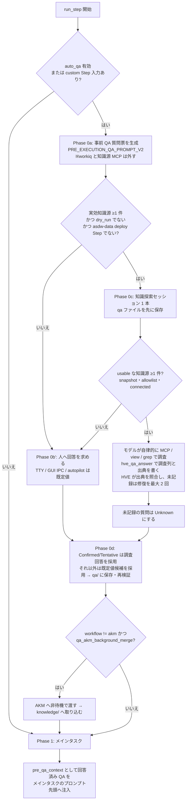

# HVE ローカル版（CLI / GUI / Prompt）における「不明点の調査 → 知識源への問い合わせ → `qa/` への出典付き保存」挙動の調査レポート

- 作成日時: 2026-10-02 03:40（JST）
- 対象リビジョン: `864592bf5`（作業ツリーに未コミットの変更あり。`hve/__init__.py` ほか 4 ファイル。本調査ではこれらを変更していない）
- 対象: `hve` のローカル実行面（`python -m hve orchestrate` の CLI、PySide6 GUI、Prompt Edition `hve prompt run`）
- 範囲外: Cloud Agent Orchestrator 経路（要件上も対象外。[requirement-definition.md](hve-dev/requirement-definition.md) §3.20 の TBD-KD-01）

---

## 1. 結論（要約）

| 確認したかった動き | 判定 | 要点 |
|---|---|---|
| 各ワークフローの各 Step 実行時に、不明点・曖昧な点を洗い出す | **条件付きで実装済み** | Step ごとの「Phase 0: 事前 QA」で質問票を作る。ただし **`auto_qa` が既定で無効**のため、有効化しない限り動かない。洗い出すのは **メインタスクの実行前だけ**。実行中に出てくる不明点を拾う事後 QA は廃止されている。 |
| 不明点を GitHub Copilot CLI に構成された問い合わせ可能なリソース（MCP）へ問い合わせる | **条件付きで実装済み** | 「知識探索エージェント」（FR-KD）が 1 つの SDK セッションで知識源 MCP を自律的に呼ぶ。ただし **知識源を 1 件以上指定**しなければならない（`--workiq` / `--knowledge-source`）。さらに **読み取り専用 tool の許可リストが定義済みなのは既定で `workiq` だけ**なので、その他の MCP は自動的に除外される。 |
| 結果を Knowledge Management の中核である `qa/` に保存する | **実装済み** | `qa/<run_id>-<step_id>-<事前QA接尾辞>` に、質問ごとの `調査回答` / `調査状態` / `調査出典` 列を保存する。 |
| 根拠となった情報源（出典）も保存する | **実装済み（強い検証付き）** | `## 調査出典` 表（`出典ID / 種別 / サーバー / ツール / 場所 / 要約`）を保存する。MCP 出典の `locator` は **同じセッションで成功した MCP 応答の本文に実在するか**を HVE が照合する。照合できなければ書き込みを拒否する。 |
| Work IQ を使う | **実装済みだが既定で無効。この環境では未認証のため実際には使えない** | `workiq` は既定の知識源候補で、6 個の読み取り tool が許可されている。この端末では Copilot CLI に `workiq` プラグインが入っているが、問い合わせると **`requires authentication`** が返る（§6）。この状態で実行すると `server-needs-auth` で除外され、人の回答または既定値へ戻る。そのため出典の無い回答になる。 |

**結論**: 求める動き（不明点の洗い出し → 知識源 MCP への自律的な問い合わせ → 出典付きで `qa/` に保存）は、コード上 **実装されており、対象テストも PASS** している（§7）。ただし **既定設定では動かない**。動かすには、少なくとも次の 3 つすべてが必要になる。

1. `auto_qa` を有効にする（CLI `--auto-qa`、GUI「QA 自動投入」、Prompt Edition の `settings_overrides.auto_qa`）
2. `workiq` を知識源として有効にする（CLI `--workiq`、GUI「Work IQ を有効化」、環境変数 `WORKIQ_ENABLED=true`）
3. Copilot CLI 側で `workiq` MCP が `connected` になっている（`/mcp auth workiq` で認証済み）

---

## 2. 調査方法

- コードを読んだ: [hve/runner.py](hve/runner.py)、[hve/knowledge_discovery.py](hve/knowledge_discovery.py)、[hve/knowledge_files.py](hve/knowledge_files.py)、[hve/qa_merger.py](hve/qa_merger.py)、[hve/workiq.py](hve/workiq.py)、[hve/config.py](hve/config.py)、[hve/__main__.py](hve/__main__.py)、[hve/orchestrator.py](hve/orchestrator.py)、[hve/prompt_execution.py](hve/prompt_execution.py)、[hve/prompt_request.py](hve/prompt_request.py)、[hve/gui/orchestrate_args.py](hve/gui/orchestrate_args.py)、[hve/gui/page_options.py](hve/gui/page_options.py)、[hve/toolsearch/policy.json](hve/toolsearch/policy.json)、[hve/toolsearch/policy.py](hve/toolsearch/policy.py)、[hve/toolsearch/resource_routing.py](hve/toolsearch/resource_routing.py)
- 指示文を読んだ: [.github/prompts/runtime/knowledge-discovery/](.github/prompts/runtime/knowledge-discovery/)（`common` / `qa` / `knowledge` / `research` / `repair`）
- 要件と照合した: [hve-dev/requirement-definition.md](hve-dev/requirement-definition.md) §3.20「知識探索エージェント（FR-KD）」
- 環境を実測した: Copilot CLI のプラグイン構成（`~/.copilot/installed-plugins/work-iq/`）、Work IQ MCP（`workiq-retrieve`）への実際の問い合わせ、既存の `qa/` ファイル 40 件
- テストを実行した: 知識探索・事前 QA・Work IQ 関連の対象テスト（§7）

---

## 3. 実装されている処理の流れ

### 3.1 Step 実行時（全 Workflow 共通、探索モード `qa`）

主な実装箇所:

- 事前 QA の実行判定: [_should_run_pre_execution_qa](hve/runner.py:1980)（`auto_qa or has_step_inputs`）と呼出し側 [runner.py](hve/runner.py:4540)。事後 QA（post-QA）は「廃止済み」とコメントで明記されている（[runner.py](hve/runner.py:4550)）。
- 事前 QA 本体: [_run_pre_execution_qa](hve/runner.py:3364)
  - 実効知識源 `self.config.effective_knowledge_sources()` を取得する。`asdw-data` の deploy Step では空にする。
  - 質問票を生成するサブセッションでは、`disabled_mcp_servers` に `workiq` と知識源を加える（質問の生成に知識源は使わない設計。FR-KD-06）。
  - 知識探索を行った場合は人の回答を待たない（`_discovered=True`。[runner.py](hve/runner.py:3620)）。
- 知識探索の起動: [_run_pre_qa_knowledge_discovery](hve/runner.py:3288)
  - 未回答の質問票を `qa/` へ先に保存し、`mode="qa"` で [run_knowledge_discovery](hve/knowledge_discovery.py:864) を呼ぶ。
  - 許可リストは `policy.tool_allowlist_for("knowledge", name)` だけを正本とする。
- 回答の採用: [QAMerger.adopt_research_answers](hve/qa_merger.py:634)。`Confirmed` / `Tentative` で調査回答が空でなければ調査回答を、そうでなければ既定値候補を `回答` 列へ採用する。
- 保存と後続処理: [_persist_answered_qa_and_dispatch](hve/runner.py:2007)。保存後に再検証する。調査回答は較正ログへ記録しない。`workflow_id != "akm"` かつ dispatcher がある場合だけ AKM（knowledge/ への取り込み）へ渡す。

### 3.2 Workflow 開始時（AKM / ARD のみ）

[orchestrator.py](hve/orchestrator.py:5730) の「4.6. 知識探索」は、Issue 作成の後、DAG 実行の前に 1 回だけ動く。

| Workflow | 探索モード | 書込み先 | 条件 |
|---|---|---|---|
| `akm` | `knowledge` | `hve_qa_create` で新規 `qa/<run_id>-<label>-knowledge-discovery-qa.md`。`hve_knowledge_write` で `knowledge/Dxx-*.md` と ChangeLog（出典 locator 付きの履歴行） | 実効知識源 ≥1（AKM の `sources` に `workiq` があれば自動追加）かつ非 dry-run |
| `ard` | `research` | 新規 `qa/...-knowledge-discovery-qa.md`。結果を Step 2 Issue へ 1 件コメント（[_post_ard_discovery_comment](hve/orchestrator.py:3690)） | 上記に加え `ard_workiq_enabled` または知識源の指定、かつ Step 2 を含む |

---

## 4. 観点別の詳細評価

### 4.1 「不明点・曖昧な点の調査」

| 項目 | 実装の状況 | 根拠 |
|---|---|---|
| 洗い出しのタイミング | Step ごとの **メインタスク実行前（Phase 0）だけ** | [runner.py](hve/runner.py:4540)、[runner.py](hve/runner.py:4709)（「Phase 2 (post-QA / 事後 QA) は廃止されました」） |
| 洗い出しの入力 | Step の原プロンプトだけ（最大文字数で切り詰める）。成果物はまだ存在しない前提 | [runner.py](hve/runner.py:3418) |
| 洗い出し時の知識源 | **使わない**（`workiq` と知識源 MCP を `disabled_mcp_servers` に入れる） | [runner.py](hve/runner.py:3443) |
| 既定の有効状態 | **無効**（`SDKConfig.auto_qa=False`） | [config.py](hve/config.py:383) |
| 対象 Workflow | `_should_run_pre_execution_qa` は `workflow_id` を無視するため、**全 Workflow** が対象 | [runner.py](hve/runner.py:1980) |
| 除外 | `asdw-data` の deploy Step、`dry_run`、session reuse による復旧時（`_reuse_session_id` がある場合） | [runner.py](hve/runner.py:3397)、[runner.py](hve/runner.py:4548) |

### 4.2 「Copilot CLI に構成されたリソースへの問い合わせ」

| 項目 | 実装の状況 | 根拠 |
|---|---|---|
| 問い合わせの主体 | 目的だけを与えた **1 つの SDK セッション**。問い合わせの順序・文面・回数はモデルが決める（「答えが見つかるまで言い換え、分解、追加の問い合わせを必要なだけ行う」） | [common.prompt.md](.github/prompts/runtime/knowledge-discovery/common.prompt.md)、[knowledge_discovery.py](hve/knowledge_discovery.py:1) |
| 知識源の指定 | `effective_knowledge_sources()` = `workiq`（有効時）→ `--knowledge-source` / `HVE_KNOWLEDGE_SOURCES` の順 | [config.py](hve/config.py:753) |
| 利用可否の判定（事前） | Copilot CLI の共有 resource snapshot で `enabled=True` の MCP、かつ `knowledge_tool_allowlists` に定義があるものだけ | [resolve_sources](hve/knowledge_discovery.py:95) |
| 利用可否の判定（セッション内） | `initialize_and_validate` → `mcp.list` で `connected`、かつ許可 tool が公開されていること。`needs-auth` などは `server-<status>` で除外する | [inspect_runtime_sources](hve/knowledge_discovery.py:139) |
| 許可されている tool | **`workiq` のみ定義済み**: `retrieve` / `ask` / `fetch` / `search_paths` / `get_schema` / `list_agents`。書込み系（`create_entity` など）は禁止 | [policy.json](hve/toolsearch/policy.json) `knowledge_tool_allowlists` |
| その他の MCP（`microsoft-learn`、`azure`、Context7 など） | `knowledge_tool_allowlists` に無いため、`--knowledge-source microsoft-learn` と指定しても **`no-readonly-allowlist` で除外される**。使うには `policy.json` への追加が必要 | [policy.json](hve/toolsearch/policy.json)、[knowledge_discovery.py](hve/knowledge_discovery.py:124) |
| リポジトリ内の資料 | `view` / `grep` / `glob` / `skill` を許可する（`.git/`・`.hve/`・`.env*` は拒否）。`kind=repo` の出典として使える | [decide_permission](hve/knowledge_discovery.py:625) |
| 人への質問 | 不可（`on_user_input_request` を外す）。迷う点は `Tentative` にする | [build_session_options](hve/knowledge_discovery.py:682) |
| 失敗時の扱い | usable が 0 件なら探索を実行しない → 人の回答（TTY / GUI IPC）または既定値（autopilot / 非 TTY）へ戻る。途中で例外が出た場合は、記録済みの調査結果と既定値候補を採用する | [runner.py](hve/runner.py:3593)、テスト `test_no_usable_source_falls_back_to_answer_collection` |

### 4.3 「`qa/` への保存と出典」

| 項目 | 実装の状況 | 根拠 |
|---|---|---|
| 保存先 | 事前 QA: `qa/<run_id>-<step_id>-<_PRE_EXECUTION_QA_SUFFIX>`。AKM / ARD: `qa/<run_id>-<label>-knowledge-discovery-qa.md` | [runner.py](hve/runner.py:3583)、[knowledge_files.create_qa_document](hve/knowledge_files.py:398) |
| 質問ごとの記録 | `調査回答` / `調査状態`（`Confirmed` / `Tentative` / `Unknown`）/ `調査出典`（`S1, S2…`） | [update_qa_research](hve/knowledge_files.py:420) |
| 出典の記録 | `## 調査出典` 表 `\| 出典ID \| 種別 \| サーバー \| ツール \| 場所 \| 要約 \|`。ファイル内で `S<n>` に振り直す | [knowledge_files.py](hve/knowledge_files.py:51) |
| 出典の真正性の検証 | MCP 出典は (1) server が usable、(2) tool が許可リストにある、(3) 同じセッションで同じ server・tool の成功呼出しが 1 件以上ある、(4) `locator` が 3 文字以上、(5) 正規化した `locator` が成功応答本文に含まれる、のすべてを満たす必要がある。`Confirmed` には検証済みの出典が 1 件以上必要。違反すると **ファイルを変更しない** | [verify_source](hve/knowledge_discovery.py:274)、[DiscoveryToolset._qa_answer](hve/knowledge_discovery.py:542) |
| 応答本文の保持 | プロセスのメモリ上だけ（1 呼出しにつき 1,000,000 文字、500 呼出しまで）。**MCP の応答本文そのものは `qa/` に保存しない**（保存されるのは locator と要約） | [SourceEvidence](hve/knowledge_discovery.py:226) |
| 並行実行の安全性 | OS 排他ロック、`base_sha256` による楽観ロック、一時ファイル → `os.replace` | [knowledge_files.py](hve/knowledge_files.py:209)、FR-KD-05 |
| 未記録への対処 | 調査状態が未記録の質問について修復プロンプトを最大 2 回送る。それでも残れば `Unknown` を記録する | [run_knowledge_discovery](hve/knowledge_discovery.py:864)、[repair.prompt.md](.github/prompts/runtime/knowledge-discovery/repair.prompt.md) |
| 最終回答（`回答` 列）の出典 | `Confirmed` / `Tentative` → 調査回答（出典 ID 付き）。`Unknown` → **既定値候補**（出典なし。調査状態 `Unknown` で区別できる） | [adopt_research_answers](hve/qa_merger.py:634) |
| `knowledge/` への反映 | `--qa-akm-background-merge`（既定は無効）を指定すると、非 AKM Workflow の回答済み QA を AKM へ非待機で渡す。AKM の `knowledge` モードでは D 文書の ChangeLog に出典 locator を記録する | [runner.py](hve/runner.py:2049)、[write_knowledge](hve/knowledge_files.py:625) |

### 4.4 ローカル 3 面ごとの有効化方法

| 実行面 | `auto_qa` | Work IQ | その他の知識源 | 備考 |
|---|---|---|---|---|
| CLI | `--auto-qa` | `--workiq` / `WORKIQ_ENABLED=true` | `--knowledge-source a,b` / `HVE_KNOWLEDGE_SOURCES` | 起動時に Work IQ の capability を事前確認し、`ready` でなければこの実行に限り無効化する（[__main__.py](hve/__main__.py:3907)） |
| GUI | 「QA 自動投入」（必須選択）。回答モード `autopilot` / `gui-file` | C4「Work IQ を有効化」チェック。可否の状態表示あり | C4「知識源 MCP サーバー」欄 | [page_options.py](hve/gui/page_options.py:1127)、[page_options.py](hve/gui/page_options.py:1511) |
| Prompt Edition | request の `settings_overrides.auto_qa` で上書きできる | **request から指定できない**。GUI の保存設定 `workiq` を継承する。capability が `ready` でなければ計画に `<!-- workiq-disabled ... -->` を付けて無効化する | GUI の保存設定 `knowledge_sources` を継承する（request では上書き不可） | [prompt_request.py](hve/prompt_request.py:43) `ALLOWED_SETTINGS_OVERRIDES`、[prompt_execution.py](hve/prompt_execution.py:201) |

---

## 5. Work IQ に関する特記事項

1. **位置付け**: Work IQ は「知識源の 1 つ」になった。以前の「Work IQ 専用処理」（固定 Prompt で質問ごとに 1 回問い合わせる方式）は、2026-10-01 の要件変更で廃止され、知識探索エージェントへ置き換えられている（[requirement-definition.md](hve-dev/requirement-definition.md) §3.20 冒頭）。
2. **既定で使える唯一の知識源**: `policy.json` の `resource_classifications.mcp_servers.workiq = "knowledge"` と `knowledge_tool_allowlists.workiq` が定義済みなので、追加設定なしで usable になれる唯一の MCP である。
3. **読み取り専用の担保**: 許可されるのは `retrieve` / `ask` / `fetch` / `search_paths` / `get_schema` / `list_agents` の 6 個だけ。プラグイン `workiq` v2.0.0 は「create, update, delete, send, upload」まで公開するが、HVE はセッションの `available_tools` と permission handler の両方でこれを遮断する。
4. **未接続時の扱い**: `needs-auth` / `failed` の知識源は「補助的な情報源のため実行は継続」と警告し（[runner.py](hve/runner.py:7529)）、探索から除外する。**Step は失敗しないが、出典の無い既定値回答になる**。気付きにくい点に注意が必要。
5. **AKM での縮退**: AKM の `sources` が `workiq` だけの状態で Work IQ を利用できない場合は、取り込み元が 0 件になるため実行を開始しない（CLI: [__main__.py](hve/__main__.py:3941)、Prompt: `WorkIQSourceUnavailable`）。
6. **メインタスク（Phase 1）での Work IQ**: Tool Search の resource routing（FR-TS-13）では、`knowledge` 分類の資源を全 Workflow で公開候補にできる（[policy.py](hve/toolsearch/policy.py:438)）。このため、Copilot CLI 側で `workiq` が接続済みなら、メインタスクのセッションからも読み取り 6 tool が見える可能性がある。ただし、**メインタスク中の問い合わせ結果を出典付きで `qa/` に記録する仕組みは無い**（記録されるのは MCP I/O ログだけ）。本調査ではこの点を実行時に確認していない（コードからの推定）。

---

## 6. この環境での実測結果（Work IQ）

| 確認項目 | 結果 |
|---|---|
| Copilot CLI のプラグイン | `~/.copilot/installed-plugins/work-iq/` に `workiq`（v2.0.0。MCP server 名 `workiq`、HTTP `https://workiq.svc.cloud.microsoft/mcp`、OAuth）、`workiq-preview`（v0.5.0。server 名 `workiq-preview`）、`workiq-productivity`、`microsoft-365-agents-toolkit` が導入済み |
| Work IQ への実際の問い合わせ | `workiq-retrieve` に「HVE の事前 QA・知識探索・Work IQ を知識源として qa/ に出典付きで保存する設計や要望についての議論」を問い合わせた → **`MCP server "workiq" requires authentication. Run /mcp auth workiq to authenticate.`** が返り、取得できなかった |
| HVE への影響 | この状態で `--auto-qa --workiq` を指定して実行すると、知識探索セッション内の判定で `server-needs-auth` となり、`知識源 workiq を除外します（server-needs-auth）` と警告される。usable が 0 件になるため、人の回答または既定値へ戻る |
| `workiq-preview` | server 名が `workiq` と完全一致しないため、HVE の `--workiq` の対象にならない。`--knowledge-source workiq-preview` と指定しても、許可リストに無いため `no-readonly-allowlist` で除外される |
| 既存の `qa/` の痕跡 | 40 件のうち、Work IQ 関連は旧実装の [20260813T135234-8427a6-7-workiq-pre-qa-draft.md](qa/20260813T135234-8427a6-7-workiq-pre-qa-draft.md) の 1 件だけ。中身は「WorkIQ ツールがこのセッションに公開されていない」ため全問 `STATUS: UNAVAILABLE`。**現行形式（`調査状態` / `## 調査出典`）で出典が記録された QA は、このリポジトリにまだ無い**（現行実装での実運用の実績は未確認） |

> 注: 本レポートは、Work IQ が未認証のため Microsoft 365 側の情報（会議・メール・文書）を根拠に使えていない。認証後に再度問い合わせれば、組織内の設計議論を出典として補強できる。

---

## 7. 検証の証跡（実行コマンドと結果）

着手時の baseline: `git rev-parse --short HEAD` = `864592bf5`。`git status --porcelain` では既存の変更 5 件（本調査とは無関係）。

| コマンド | 結果 |
|---|---|
| `python -m pytest hve/tests/test_knowledge_discovery.py hve/tests/test_orchestrator_knowledge_discovery.py hve/tests/test_prompt_workiq_capability.py hve/tests/test_runner_pre_qa_mcp_scope.py hve/tests/test_workiq.py -q -p no:cacheprovider` | **exit 0**（143 passed, 46 subtests passed in 14.15s） |
| `python -m pytest hve/tests/test_runner_pre_qa_knowledge_discovery.py -q -p no:cacheprovider` | **exit 0**（5 passed in 2.27s）。対象: 調査回答を待たずに採用する / 探索が失敗しても待たない / usable 0 件なら回答収集へ戻る / 知識源なしなら探索しない / dry-run なら探索しない |
| `workiq-retrieve`（MCP 直接呼出し） | 失敗: `requires authentication` |

---

## 8. 期待する動きとの差分と推奨事項

要求にない改善は実装していない。以下は今後の対応案である。

| # | 差分（現状） | 影響 | 推奨 |
|---|---|---|---|
| 1 | `auto_qa` と `workiq` が既定で無効 | 何も設定しないと、不明点の調査も問い合わせも `qa/` への保存も行われない | 運用の既定値（GUI 保存設定）で `auto_qa=有効`、`workiq=有効` にする。HVE 本体の既定値を変えるかは別途判断 |
| 2 | Work IQ が未認証 | 有効にしても `server-needs-auth` で除外され、既定値回答になる | Copilot CLI で `/mcp auth workiq` を実行し、HVE（GUI）を再起動する。実行ログに `知識源 workiq を除外します` が出ていないこと、`qa/` の `## 調査出典` に `mcp \| workiq` の行があることで確認する |
| 3 | 既定の許可リストは `workiq` だけ | `microsoft-learn` などの調査向け MCP を知識源にできない | 必要な MCP の読み取り tool を [policy.json](hve/toolsearch/policy.json) の `knowledge_tool_allowlists` に追加する（例: `microsoft-learn: [microsoft_docs_search, microsoft_docs_fetch]`）。FR-KD-02 で正本は 1 か所と決まっているため、ここだけを変更する |
| 4 | 不明点の洗い出しはメインタスク実行前だけ | 実行中に判明した不明点は調査されず、`qa/` にも残らない（事後 QA は廃止済み） | 必要なら「メインタスク終了時に未解決の前提を `qa/` へ追記し、知識探索を 1 回行う」機能を要件として起票する |
| 5 | 質問票の生成時には知識源を使わない（設計どおり） | 知識源を見れば不要になる質問も作られる | 設計判断として妥当（同意境界と再現性のため）。変更は不要 |
| 6 | `Unknown` の質問には出典の無い既定値候補が採用される | 最終回答の根拠が「推測の既定値」になる | `qa/` の `調査状態=Unknown` を後で人が見直す運用にする。または AKM 取り込み時に `Unknown` を除外する規則を検討する |
| 7 | Prompt Edition の request で `workiq` / `knowledge_sources` を指定できない | request 単体では Work IQ を使うかどうかを決められず、GUI の保存設定に依存する | 必要なら `ALLOWED_SETTINGS_OVERRIDES` へ `workiq` / `knowledge_sources` を追加する案を起票する（資格情報ではないため追加しても安全側） |
| 8 | メインタスク中の Work IQ 呼出しは `qa/` に記録されない | メインタスクが Work IQ で得た根拠は MCP I/O ログにしか残らない | 必要なら、メインタスクで知識源を使った結果も出典付きで `qa/` へ記録する仕組みを検討する |
| 9 | 現行形式で出典付きの QA の実績がリポジトリに無い | 実環境での end-to-end 動作は未確認 | §8-2 の認証後に、小さな Workflow / Step 1 つで `--auto-qa --workiq` を実行し、`qa/` に `## 調査出典` が出力されることを確認する |

---

## 9. 参照した主なファイル

- 要件: [hve-dev/requirement-definition.md](hve-dev/requirement-definition.md) §3.20 FR-KD-01〜
- 知識探索の本体: [hve/knowledge_discovery.py](hve/knowledge_discovery.py)
- `qa/` / `knowledge/` への書込みの単一実装: [hve/knowledge_files.py](hve/knowledge_files.py)
- 事前 QA の制御: [hve/runner.py](hve/runner.py)
- AKM / ARD の知識探索: [hve/orchestrator.py](hve/orchestrator.py)
- Work IQ の capability 判定と縮退: [hve/workiq.py](hve/workiq.py)
- 許可リスト: [hve/toolsearch/policy.json](hve/toolsearch/policy.json)
- 指示文: [.github/prompts/runtime/knowledge-discovery/common.prompt.md](.github/prompts/runtime/knowledge-discovery/common.prompt.md)、[qa.prompt.md](.github/prompts/runtime/knowledge-discovery/qa.prompt.md)、[repair.prompt.md](.github/prompts/runtime/knowledge-discovery/repair.prompt.md)
- テスト: [hve/tests/test_knowledge_discovery.py](hve/tests/test_knowledge_discovery.py)、[hve/tests/test_runner_pre_qa_knowledge_discovery.py](hve/tests/test_runner_pre_qa_knowledge_discovery.py)
